# Project Architecture Overview

## App Overview

**RPG AI Image Describer** is a Next.js application that transforms user-uploaded images into an interactive, turn-based storytelling game. Users select or import a template, upload images, and the app uses an LLM (via LM Studio) to generate detailed image descriptions and branching story segments. After each turn, the user is presented with choices (soon to be LLM-generated), and their decisions shape the narrative. All template data—including prompts and images—are stored in a portable, folder-based structure for easy sharing and extensibility. The system is designed for strict TDD, robust state management (Zustand), and future expansion into non-game use cases (e.g., marketing, education).

## UI/UX & Rendering Logic: Turn Order
The list of turns is rendered in reverse order (latest first) for improved usability. This is achieved by reversing the turns array before mapping over it in the UI.

## Tournament UI Dark Theme & Visual Design (2025-01-27)

### Overview
The tournament system has been enhanced with a modern dark theme and improved layout inspired by the battle results modal, creating a cohesive visual experience across all fighting game pages.

### Design System
- **Color Palette**: Dark background with vibrant purple/blue accent colors
- **Typography**: Improved font hierarchy and spacing for better readability
- **Layout**: Enhanced spacing and visual separation between components
- **Responsive Design**: Better mobile and desktop layout optimization

### Component Architecture
- **TournamentBracket**: Dark theme with improved fighter card styling and hover effects
- **TournamentControls**: Enhanced button styling with modern hover states
- **TournamentList**: Better table styling with improved readability and contrast
- **TournamentCreator**: Modern form styling with better visual feedback and validation

### Technical Implementation
- **CSS Variables**: Consistent color scheme using CSS custom properties
- **Component Styling**: Updated all tournament components with dark theme classes
- **Responsive Grid**: Improved layout using CSS Grid for better space utilization
- **Hover States**: Enhanced interactive elements with smooth transitions

### Benefits
- **Consistency**: Unified design language across all fighting game pages
- **Accessibility**: Better contrast ratios and improved readability
- **Modern Feel**: Contemporary UI that matches current design trends
- **User Experience**: Improved visual hierarchy and intuitive navigation flow
- **Professional Appearance**: Polished interface suitable for production use

## Fighting Game Battle System (2025-01-27)

### Winner Determination Logic
The battle system uses a damage-based scoring mechanism to determine winners:

**Core Logic:**
1. **KO Victory**: If one fighter's health reaches 0, they lose immediately
2. **Damage-Based Victory**: If both fighters survive, the winner is determined by total damage dealt
3. **Draw**: Only occurs when both fighters deal exactly the same amount of damage

**Implementation:**
- `resolveBattle()` function in `src/lib/utils.ts` tracks damage dealt by each fighter across all rounds
- Damage is calculated per round based on attacker strength, defender defense, and random events
- Winner determination compares `aDamageDealt` vs `bDamageDealt` rather than remaining health
- This ensures the more aggressive/effective fighter wins, not just the one with more starting health

**Example:**
- Donkey Kong deals 74 total damage, takes 57 damage → Should win
- Harry Callahan deals 57 total damage, takes 74 damage → Should lose
- Previous logic incorrectly called this a draw based on remaining health

### Battle Round Structure
Each battle round consists of:
1. **Attacker Selection**: Alternates between fighters (odd rounds: Fighter A, even rounds: Fighter B)
2. **Damage Calculation**: Based on attacker strength, defender defense, and random modifiers
3. **Health Updates**: Defender's health is reduced by calculated damage
4. **Commentary Generation**: LLM generates attack and defense narratives
5. **Round Logging**: All data is recorded for replay and analysis

### Commentary System
The battle commentary system generates dramatic, action-oriented narratives:

**Current Features:**
- Uses DeepSeek R1 Distill Qwen 14B Uncensored model for better narrative quality
- Generates separate attack and defense commentary for each round
- Includes damage amounts naturally in the narrative context
- Post-processing filters out nonsense words, ALL CAPS, and prompt leakage

**Quality Improvements:**
- Dramatic and engaging narrative flow
- Character-specific actions and descriptions
- Natural integration of damage numbers
- Reduced nonsense words and formatting issues

**Remaining Issues:**
- Some commentary over-filtered (showing just ".")
- Inconsistent tone between formal and casual
- Repetitive phrases across rounds
- Case inconsistencies in sentence formatting

## Game Dynamics: Good vs Bad (Yin/Yang) System
Dungeon Master config now includes a "Bad" profile picture and definition. These are stored in the template/session and passed to the LLM for prompt generation. The DM can use this info to create richer, more dynamic stories with a clear antagonist or opposing force.

## Dungeon Master Template & Selection
DM templates now include a profile picture and pre-formatted config. The DM selection UI allows users to browse and select a DM before starting a game. The selected DM's config and image are stored in the session/template and used throughout the game.

## Character Scoring & Gamification
Character stats are being evaluated for relevance and impact on gameplay. The system will support stat-based skill checks, branching, and possible win/lose conditions. All stat changes and their effects will be strictly typed and documented.

## Glossary

| Term                | Definition                                                                                           |
|---------------------|------------------------------------------------------------------------------------------------------|
| **Template**        | A JSON-based configuration that defines the structure, prompts, images, and rules for a game/story.  |
| **Turn**            | A single round in the game where an image is described and a story segment is generated.             |
| **Choice**          | A set of options presented to the user after each story turn, influencing the next story segment.    |
| **Outcome**         | The result of a user's choice, which may affect the story, character stats, or available options.    |
| **Prompt**          | A text instruction sent to the LLM to generate image descriptions, stories, or choices.              |
| **Story History**   | The accumulated story segments generated for each turn, used as context for the final story.         |
| **Final Story**     | A cohesive narrative generated at the end, weaving together all turns, choices, and outcomes.        |
| **Zustand Store**   | The global state management system used to track templates, character state, and game progress.      |
| **LM Studio**       | The local LLM server used for all AI generation tasks (image description, story, choices, etc.).     |
| **Toast**           | A non-intrusive notification shown to the user for key actions (save, import, error, etc.).          |
| **UUID**            | Universally Unique Identifier, used for all template and list keys to prevent React key collisions.  |
| **Portable Template** | A template folder containing all prompts (as JSON) and images, designed for easy sharing/import.   |

## System Diagrams

### 1. User Flow Diagram

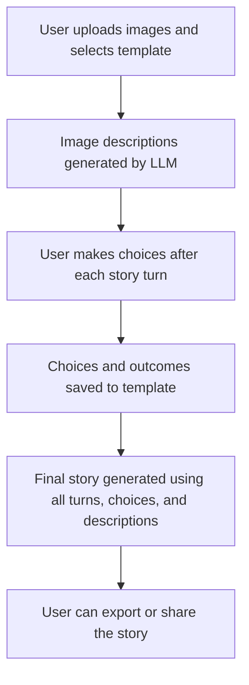

### 2. Data Model (ER Diagram)

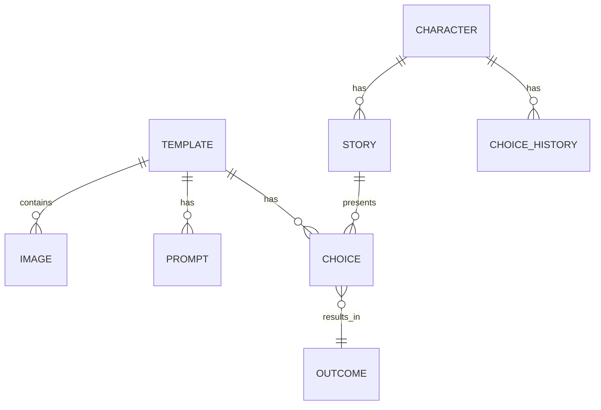

### 3. State & Storage Architecture

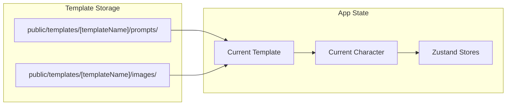

## Platform & Framework
- **Framework:** Next.js 15 (App Router)
- **Language:** TypeScript (strict mode)
- **Styling:** Tailwind CSS v4 (using `@import "tailwindcss"` syntax)
- **UI Components:** shadcn/ui
- **AI Integration:** LM Studio SDK

## Folder Structure
```
src/
├── app/                 # Next.js App Router (pages, layout, API routes)
├── components/          # React components (UI, layout, feature)
├── hooks/               # Custom React hooks
├── lib/                 # Utilities, constants, Zustand stores, types
│   ├── stores/          # Zustand state management
│   ├── types/           # TypeScript type definitions
│   └── ...
└── types/               # (Legacy or shared types)
public/                  # Static assets (images, icons)
jest.config.js           # Jest configuration
```

## State Management
- **Zustand** for all character/game state
  - Store: `src/lib/stores/characterStore.ts`
  - Uses `persist` middleware for localStorage persistence
  - All state updates are via store actions (no direct mutation)
  - **Image History:** Each image entry now stores its own AI-generated description and story, enabling robust per-turn display and replay.
- **Turn System:**
  - 3-turn limit, managed in Zustand
  - Reset Game button resets all state
  - All per-turn controls (upload, generate story, choices) are strictly gated to only appear at the correct stage for the current turn.
- **Client-Only Rendering for Zustand-Dependent UI:**
  - All UI components that depend on Zustand state (e.g., CharacterStats, stats in Header) are now wrapped in a ClientOnly pattern.
  - This pattern waits for the client to mount before rendering the component, ensuring that the state is always consistent between server and client.
  - This prevents hydration mismatches and SSR/CSR state issues, which can occur if Zustand state is accessed during SSR.
  - **Pattern:**
    ```tsx
    const ClientOnly: React.FC<{ children: React.ReactNode }> = ({ children }) => {
      const [mounted, setMounted] = useState(false);
      useEffect(() => setMounted(true), []);
      if (!mounted) return null;
      return <>{children}</>;
    };
    // Usage:
    <ClientOnly><CharacterStats ... /></ClientOnly>
    ```
  - This is the recommended best practice for Zustand + Next.js (App Router) projects.

## Testing Process
- **Unit Testing Framework:** Jest + React Testing Library
- **E2E Testing Framework:** Playwright
- **Workflow:** Strict TDD (Test-Driven Development)
  - Write failing test → implement code → make test pass → refactor
  - All features require both unit and E2E tests before implementation
- **Test Coverage:**
  - **Unit Tests**: UI, state, and game logic are all covered
  - **E2E Tests**: Critical user flows, integration scenarios, and regression prevention
  - Reset Game and turn logic are explicitly tested
  - **463 unit tests passing** with comprehensive coverage across all systems
  - **E2E tests** covering `/playervs` and `/tournament` critical flows
- **Run unit tests:** `npm test` or `npm run test:watch`
- **Run E2E tests:** `npx playwright test` or `npx playwright test --headed`
- **Build check:** `npm run build` (must pass before commit)

### Recent Test Improvements (2025-01-27)

#### Audio System Testing Enhancements
The Audio system now has robust testing with comprehensive mocking:

- **Enhanced Audio Mock**: Created a sophisticated mock that tracks property assignments (`volume`, `preload`, `currentTime`) and play call counts
- **Module Mocking Strategy**: Used `jest.resetModules()` and `jest.doMock()` to ensure sound store mocks are applied before importing code under test
- **Async Test Patterns**: Implemented proper async/await patterns with small delays to allow property assignments to complete before assertions
- **Error Simulation**: Added comprehensive error handling tests with realistic mock scenarios
- **Result**: All 11 Audio-related tests now pass consistently

#### LM Studio Client Test Fixes
Fixed the LM Studio client tests to properly validate API requests:

- **Fetch Body Structure**: Updated test assertions to match actual fetch call structure (checking message content rather than raw body string)
- **Proper Mock Validation**: Tests now validate the correct parts of the API request structure
- **Result**: All LM Studio client tests now pass with proper validation

#### Character Store Test Improvements
Enhanced character store tests with proper type validation:

- **Valid ImageDescription Objects**: Fixed all test cases to use valid `ImageDescription` objects instead of incomplete literals
- **Type Safety**: Ensured all test data matches the expected TypeScript interfaces
- **Result**: All character store tests now pass with proper type validation

### Test Coverage Summary
- **Unit Tests**: 463 passing, 0 failing
- **E2E Tests**: All Playwright tests passing for critical user flows
- **Test Files**: 23 unit test files covering 38 source files + E2E test files
- **Coverage Areas**:
  - ✅ UI Components (React Testing Library)
  - ✅ Custom Hooks (useImageAnalysis, useStoryGeneration)
  - ✅ Zustand Stores (characterStore, dmStore, templateStore)
  - ✅ API Routes (all endpoints)
  - ✅ Utility Functions (soundUtils, lmstudio-client)
  - ✅ Type Validation (all type definitions)
  - ✅ Error Handling (comprehensive error scenarios)
  - ✅ E2E User Flows (Playwright)
    - ✅ `/playervs` page loading and navigation
    - ✅ Demo data verification
    - ✅ Rebalance Fighters flow
    - ✅ Tournament page functionality

## TDD Process and Best Practices

### TDD Workflow for Each Feature
1. **Write Failing Tests First**
   - **Unit Tests**: Create comprehensive Jest test suite covering all requirements
   - **E2E Tests**: Create Playwright tests for critical user flows and integration scenarios
   - Ensure tests fail initially (red phase)
   - Use descriptive test names that explain the expected behavior
   - Test edge cases and error conditions

2. **Implement Minimal Code**
   - Write only the code necessary to make tests pass (green phase)
   - Avoid over-engineering or implementing future features
   - Focus on the current failing test only

3. **Refactor and Improve**
   - Clean up code while ensuring tests continue to pass
   - Improve readability, performance, and maintainability
   - Maintain strict TypeScript typing throughout

4. **Quality Assurance**
   - Run all unit tests: `npm test`
   - Run all E2E tests: `npx playwright test`
   - Verify production build succeeds (`npm run build`)
   - Ensure no regressions in either test suite

### E2E Testing Strategy with Playwright

#### Test Organization
- **Location**: `e2e/` directory
- **Naming**: `[page-name].spec.ts` (e.g., `playervs.spec.ts`, `tournament.spec.ts`)
- **Configuration**: `playwright.config.ts` for browser setup and timeouts

#### Test Categories
1. **Critical User Flows**
   - Page loading and navigation
   - Core functionality (e.g., Rebalance Fighters button)
   - Data persistence and state management

2. **Integration Scenarios**
   - API interactions and error handling
   - Cross-component communication
   - End-to-end user journeys

3. **Regression Prevention**
   - UI element presence and accessibility
   - Performance and responsiveness
   - Cross-browser compatibility

4. **Visual Regression Testing**
   - Screenshot comparison to detect UI changes
   - Baseline creation and change detection
   - Manual review process for intentional changes

#### Best Practices
- **Reliable Selectors**: Use `data-testid` attributes for stable element selection
- **Proper Timing**: Wait for network idle and element visibility before assertions
- **Error Handling**: Test both success and failure scenarios
- **Cross-Browser**: Run tests in multiple browsers (Chrome, Firefox, Safari)
- **Visual Regression**: Use Playwright's screenshot comparison for UI consistency

#### Test Execution
```bash
# Run all E2E tests
npx playwright test

# Run specific test file
npx playwright test e2e/playervs.spec.ts

# Run with browser UI (for debugging)
npx playwright test --headed

# Run in specific browser
npx playwright test --project=chromium

# Generate test report
npx playwright show-report

# Run visual regression tests only
npx playwright test --grep "visual regression"
```

#### Integration with TDD
- **Pre-Implementation**: Write E2E tests that define the expected user experience
- **During Development**: Use E2E tests to verify integration points
- **Post-Implementation**: Use E2E tests for regression testing and quality assurance
- **CI/CD**: Include E2E tests in automated testing pipeline
   - Test in browser for visual verification (`npm run dev`)

### Playwright E2E Testing & Visual Regression System (2025-01-27)

#### Overview
A comprehensive Playwright testing system has been implemented to ensure UI consistency, prevent accidental removals, and maintain visual quality across all fighting game pages.

#### Test Coverage
- **e2e/playervs.spec.ts**: PlayerVs page functionality, fighter upload, battle flow, and visual regression
- **e2e/battle-arena.spec.ts**: Battle Arena page functionality, fighter creation, and visual regression  
- **e2e/tournament.spec.ts**: Tournament system functionality, bracket management, and visual regression
- **e2e/leaderboard.spec.ts**: Leaderboard functionality, fighter details, and visual regression

#### Key Features
- **Visual Regression Testing**: Screenshot comparison to detect UI changes
- **State Testing**: Comprehensive coverage of different app states (empty, with data, error states)
- **User Flow Testing**: Complete user journeys from setup to completion
- **Cross-Browser Testing**: Tests run on Chromium, Firefox, and WebKit
- **Automated CI Integration**: Tests run automatically on pull requests

#### Test Categories
1. **Functional Tests**: Verify all UI elements are present and interactive
2. **State Tests**: Test different app states (loading, error, success, empty)
3. **User Flow Tests**: Complete workflows (upload → battle → results)
4. **Visual Regression Tests**: Screenshot comparison for UI consistency
5. **Error Handling Tests**: Graceful handling of edge cases and failures

#### Visual Regression Workflow
1. **Baseline Creation**: First run creates baseline screenshots
2. **Change Detection**: Subsequent runs compare against baseline
3. **Review Process**: Manual review of diffs before updating baselines
4. **Intentional Changes**: Update baselines for deliberate UI improvements

#### Benefits
- **Prevents Accidental Removals**: Catches when UI elements disappear
- **Ensures Consistency**: Maintains visual quality across updates
- **Automated Quality Gate**: CI/CD integration prevents regressions
- **Cross-Browser Compatibility**: Tests ensure consistent behavior
- **Documentation**: Tests serve as living documentation of expected behavior

### Test Strategy Best Practices

#### Element Selection
- **Prefer `data-testid` attributes** for reliable element selection
- Use `within()` queries to scope assertions to specific components
- Implement `getAllByText()` with indexing for multiple instances
- Use function matchers for text that may be split across elements

#### Test Isolation
- Each test should be independent and not rely on previous test state
- Use fresh component instances for each test case
- Reset any global state between tests
- Avoid test interdependencies

#### State Management Testing
- Test component state changes and side effects
- Verify proper prop passing and event handling
- Test loading states, error states, and success states
- Ensure accessibility attributes are properly set

### Example TDD Implementation: Per-Turn Accordion Flow

#### Step 1: Write Comprehensive Failing Tests
```typescript
it('shows spinner while story is loading, then displays story as soon as available', () => {
  render(<TurnCard {...baseProps} isStoryLoading={true} story="" />);
  expect(screen.getByTestId('story-loader')).toBeInTheDocument();
  
  render(<TurnCard {...baseProps} isStoryLoading={false} story="The generated story!" />);
  const storyContent = screen.getAllByTestId('story-content').find(el => el.getAttribute('data-state') === 'open');
  expect(within(storyContent!).getByText('The generated story!')).toBeInTheDocument();
  expect(within(storyContent!).queryByText(/Not available yet/i)).not.toBeInTheDocument();
});
```

#### Step 2: Implement Component Logic
```typescript
<AccordionContent data-testid="story-content">
  {isStoryLoading ? (
    <div data-testid="story-loader" className="flex items-center gap-2 py-4">
      <LoadingSpinner /> <span>Generating story...</span>
    </div>
  ) : story ? (
    <div className="prose prose-sm max-w-none">{story}</div>
  ) : (
    <div className="text-gray-400 italic">Not available yet</div>
  )}
</AccordionContent>
```

#### Step 3: Test Refinement
- Handle multiple accordion instances with proper indexing
- Ensure correct accordion state before querying content
- Use robust selectors that work across different component states

### Key Technical Decisions

#### Component Architecture
- Add new props to interfaces with strict typing
- Maintain existing accessibility patterns
- Preserve UI/UX consistency with existing components
- Use conditional rendering for different states

#### Error Handling
- Implement graceful handling of component state changes
- Provide clear error messages for test failures
- Handle edge cases and unexpected states

### Lessons Learned
1. **Test Isolation**: Each test should be independent and not rely on previous test state
2. **Element Selection**: Use specific selectors (`data-testid`) rather than generic text queries when possible
3. **State Management**: Always verify the expected state before making assertions
4. **Accessibility**: Maintain proper ARIA attributes throughout implementation
5. **Type Safety**: Ensure all new props and interfaces are strictly typed

### Future TDD Implementations
This process can be applied to future features by:
1. Writing comprehensive failing tests that cover all requirements
2. Implementing minimal code to make tests pass
3. Refining tests and code iteratively
4. Ensuring full test coverage and build success
5. Documenting the process for future reference

## UI/UX
- **Layout:**
  - Responsive, stacked card layout (no grid)
  - Each image/turn is displayed as a vertical `GalleryCard` with:
    - The image at the top
    - An accordion below with two sections: "Image Description" (collapsed by default) and "Image Story" (expanded by default)
    - A "Turn X" label for each card, newest at the top
  - Header displays character stats
  - Main area: image upload, preview, description, story, and controls
- **Reset Game:**
  - Button appears if any turns have been used
  - Resets all state and clears persisted storage
- **Prompts:**
  - Dual prompt system (default/custom) for both image description and story generation
- **Per-Turn Flow:**
  - **Image Upload:** Only visible if no image has been uploaded for the current turn and no description is being generated or available.
  - **Image Description:** Spinner and content appear in the TurnCard for the current turn. As soon as a description is available, the upload area disappears.
  - **Generate Story:** Controls only appear after the image description is fully generated for the current turn, and disappear once the story is being generated or is available.
  - **Choices:** Controls only appear after the story is available for the current turn, and disappear once choices are being generated or are available.
  - This strict gating ensures a clear, stepwise RPG flow and prevents user confusion.

## Conventions & Best Practices
- **TypeScript:**
  - All code is strictly typed
  - No use of `any` except in legacy/test code
- **Component Structure:**
  - Components are colocated with their tests
  - Use functional components and hooks
- **State:**
  - All state is managed via Zustand store actions
  - No direct mutation of state outside the store
- **Testing:**
  - All new features require tests
  - Tests must pass before code is considered complete
- **Commits:**
  - Conventional commit messages (feat, fix, chore, etc.)
  - Commit after passing tests and build
- **Zustand State:**
  - All UI that depends on Zustand state should be rendered client-only using a ClientOnly pattern.
  - This prevents hydration mismatches and ensures state consistency between server and client.
  - Never access Zustand state directly in server components or during SSR.

## Decision Rationale
- **Next.js App Router:** Modern, flexible routing and layouts
- **Zustand:** Simple, scalable state management with persistence
- **shadcn/ui:** Modern, accessible UI components
- **TDD:** Ensures reliability and maintainability
- **Stacked Card Layout:** More flexible and visually appealing than a grid for this use case; supports per-turn replay and accordion-based detail viewing.

## Template System Architecture

### Overview
The template system provides complete game state persistence and restoration capabilities, enabling exact game resumption and rapid testing scenarios.

### Core Components

#### 1. Template Schema (`src/lib/types/template.ts`)
- **GameTemplate Interface**: Complete game state storage including character, images, prompts, configuration, and a `choices` array per turn (generated by the LLM, with all options and outcomes)
- **Validation Functions**: Strict type checking and data integrity validation
- **Template Utilities**: Creation, cloning, version compatibility checking
- **Application System**: Core logic for applying templates and restoring game state

#### 2. Template Store (`src/lib/stores/templateStore.ts`)
- **Zustand Store**: CRUD operations for template management
- **Template Selection**: Active template tracking and selection
- **Persistence**: Local storage integration for template persistence

#### 3. Template Manager UI (`src/components/TemplateManager.tsx`)
- **Template Management**: Create, select, delete, import/export templates
- **Template Application**: Apply templates with visual feedback
- **Missing Content Detection**: Display what content needs to be generated
- **Result Display**: Success/error states with detailed feedback

### Template Application Flow

#### 1. Template Validation
```typescript
const result = applyTemplate(template);
// Validates template structure, version compatibility, and data integrity
```

#### 2. Game State Restoration
```typescript
// Restore character state
characterStore.updateCharacter({
  ...template.character,
  currentTurn: calculatedTurn
});

// Restore image history
characterStore.updateCharacter({ imageHistory: [] });
template.images.forEach(image => characterStore.addImageToHistory(image));

// Restore final story if exists
if (template.finalStory) {
  characterStore.updateCharacter({ finalStory: template.finalStory });
}
```

#### 3. Missing Content Detection
- **Complete Templates**: No missing content (has final story)
- **Incomplete Templates**: Detect missing images and final story
- **Visual Feedback**: Display missing content list to user

### Integration Points

#### Character Store Integration
- **ExtendedCharacter Interface**: Added `finalStory` property for template integration
- **State Restoration**: Complete character state restoration from templates
- **Image History Management**: Bulk loading of template images

#### UI Integration
- **TemplateManager Component**: Full template management interface
- **Apply Button**: One-click template application
- **Result Display**: Visual feedback on application success/failure
- **Missing Content Warnings**: Clear indication of what needs generation

### Benefits

#### 1. Gameplay Continuity
- **Exact Resumption**: Resume games from exact saved state
- **Complete State**: Character stats, image history, turn progress preserved
- **No Data Loss**: All generated content maintained in templates

#### 2. Development Speed
- **Rapid Testing**: Use pre-generated templates for instant UI testing
- **Consistent Data**: Reliable test scenarios with known content
- **Template Reuse**: Share complete game sessions between developers

#### 3. User Experience
- **Visual Feedback**: Clear indication of template application status
- **Missing Content Awareness**: Users know what content needs generation
- **Error Handling**: Robust validation and error reporting

### Implementation Status

#### ✅ Phase 24.1: Enhanced Schema (COMPLETED)
- Complete GameTemplate schema with full game state
- Comprehensive validation and utility functions
- Template store with CRUD operations
- Basic template management UI

#### ✅ Phase 24.2: Template Application System (COMPLETED)
- `applyTemplate()` function with validation
- Character store integration for state restoration
- Missing content detection and reporting
- Enhanced TemplateManager UI with apply functionality
- Comprehensive test coverage

#### 🔄 Phase 24.3: Smart Content Regeneration (PENDING)
- Automatic detection of missing content
- AI-powered content generation for incomplete templates
- Integration with existing image analysis and story generation

#### 🔄 Phase 24.4: Testing Integration (PENDING)
- Template-based test data generation
- Integration with Jest testing environment
- Automated template application in test suites

#### 🔄 Phase 24.5: Advanced Features (PENDING)
- Template categories and search
- Template sharing and collaboration
- Advanced editing and management features

### Template Generation Type
- Each template includes a `type` field (e.g., `game`, `comics`, `business`, etc.).
- The app uses this field to enable or disable features and UI for different use cases.
- All new features must check the template type and be designed for extensibility.
- **For type 'game', each turn includes LLM-generated choices and outcomes, which are saved to the template and referenced in the final story.**
- **The final story prompt should reference both the choices and the outcomes for each turn.**
- **LLM-generated choices make the game more dynamic and replayable, and all choices/outcomes are persisted for export, sharing, and replay.**

---
This document should be updated as the project evolves. Use it as a reference for onboarding, architecture decisions, and best practices.

## Image Storage and Template Portability

### Best Practices
- All images referenced in templates should be stored in `public/imageRepository/` and referenced as `/imageRepository/filename.jpg`.
- On local development, copy uploaded/generated images to this folder.
- On template export, ensure all referenced images are present and optionally export as a zip with images + template JSON for portability.
- On Vercel (production), the `public/` folder is read-only; all images must be present at build time and committed to the repo.
- No uploads or LLM generation in production unless using a cloud storage backend.
- In the future, for uploads in production, use a cloud storage solution (e.g., S3, Supabase Storage) and update template image URLs accordingly.

### Environment Handling Table
| Environment      | Image Storage Location         | Uploads Allowed? | LLM Generation? | Template Usage         |
|------------------|-------------------------------|------------------|-----------------|-----------------------|
| Local (Windows)  | public/imageRepository/       | Yes              | Yes             | Generate & Export     |
| Vercel (Prod)    | public/imageRepository/       | No               | No              | Import & Use Only     |

### Notes
- This section is a reference for future-proofing and deployment strategy.
- When deploying to Vercel, ensure all images referenced in templates are present in `public/imageRepository/` and committed to the repo.
- For future cloud storage, update image management and template export/import logic accordingly.

## Turn Limit Editing (2025-07-01)
- The template system allows users to increase the turn limit at any time.
- Users can decrease the turn limit only if the current turn is less than or equal to the new limit.
- All turn-based logic (story generation, upload disabling, final story button, etc.) uses the dynamic turn limit from the template config.
- Validation prevents decreasing the turn limit below the current turn, with clear user feedback.

## Toast Notification System (2025-07-01)
- A global toast notification system is used for all key template and game interactions:
  - Export, import, save, delete, select, apply, and edit templates
  - Any other important user action (success or error)
- Toasts are small, subtle, and non-intrusive, appearing in a consistent location (e.g., bottom-right or top-right).
- Toasts disappear automatically after a short duration and are accessible to screen readers.
- All toast logic is centralized for maintainability and consistency.
- All relevant tests verify toast appearance and content for user actions.

## Template ID and Naming Architecture (2025-07-01)
- All template IDs are generated using `uuid.v4()` (from the uuid npm package) to guarantee uniqueness across all operations (creation, copy, import, edit).
- When a template is created, imported, or renamed to a duplicate, a new UUID is assigned.
- Template names are auto-incremented: if a name already exists, the new template will be named `name (copy)`, `name (copy 2)`, etc.
- This approach eliminates duplicate React key warnings and ensures a clear, user-friendly template list.
- The system is robust against all edge cases, including rapid user actions and bulk imports.

### Prompt and Image Storage (2025-07-xx)
- Prompts for each template are stored as JSON in `public/templates/[templateName]/prompts/prompts.json`, where `[templateName]` is a URL-safe string.
- All images for a template are stored in `public/templates/[templateName]/images/`.
- The template JSON references these relative paths for prompts and images.
- No zip export is required; copying the template folder is sufficient for portability and sharing.
- This approach is extensible for future cloud storage or advanced export/import features.

---

# AI Image Describer Architecture

## Future Directions & Use Cases

For a living list of game mechanics and creative/business/educational use cases, see [IDEAS.md](./IDEAS.md).

The codebase is designed to remain flexible and extensible, so that future features—such as branching game mechanics, marketing story generation, or educational tools—can be added without major refactoring.

---

# Documentation Review Workflow

## Overview
This workflow ensures comprehensive, up-to-date documentation when proposing or implementing new functionality. **Use the tiered approach in `DOCUMENTATION_REVIEW_TEMPLATE.md` for efficiency.**

## Quick Reference

### Tier 1: Small Changes (5-10 min)
- Bug fixes, minor UI tweaks, simple text changes
- Update code comments + quick test

### Tier 2: Medium Features (15-30 min)
- New components, API endpoints, state changes
- Update `ARCHITECTURE.md`, `spec.md`, add tests

### Tier 3: Major Features (30-60 min)
- New game mechanics, major refactoring, new template types
- Full documentation review + architecture impact assessment

## Required Documents for Review

### Core Documentation
1. **`ARCHITECTURE.md`** - System architecture, data models, technical decisions
2. **`spec.md`** - Project specification, phases, and implementation status
3. **`IDEAS.md`** - Future use cases and feature ideas (Tier 3)
4. **`README.md`** - Project overview and setup instructions (Tier 3)

### Supporting Documentation (Tier 3)
5. **`.cursor/rules/`** - Development workflow and coding standards
6. **Configuration files** - Dependencies, testing, TypeScript settings

## Essential Checklist (All Tiers)

### Before Implementation
- [ ] **What**: What exactly are we building?
- [ ] **Why**: Why are we building it this way?
- [ ] **How**: How does it fit into the existing architecture?
- [ ] **Future**: Will this work with all template types?

### During Implementation
- [ ] **Code Comments**: Document the "why" not just the "what"
- [ ] **Type Safety**: Ensure strict TypeScript types
- [ ] **Tests**: Write tests that document expected behavior

### After Implementation
- [ ] **Update Spec**: Mark tasks complete in `spec.md`
- [ ] **Update Architecture**: If data models or flow changed
- [ ] **Commit**: Clear commit message explaining the change

## Key Principles

### Efficiency Over Exhaustiveness
- **Focus on decisions**: Document the "why" not just the "what"
- **Update as you go**: Don't leave documentation for the end
- **Use the tier system**: Don't over-document simple changes
- **Leverage existing patterns**: Follow established conventions

### Quality Over Quantity
- **Consistency**: Use consistent terminology across all documents
- **Clarity**: Write for both current and future contributors
- **Currency**: Keep documentation updated with code changes
- **Completeness**: Every feature should be documented in at least one place

## Benefits

### For Current Development
- **Reduced Confusion**: Clear understanding of what needs to be updated
- **Better Planning**: Comprehensive impact assessment before implementation
- **Faster Iteration**: Tiered approach prevents over-documentation

### For Future Contributors
- **Quick Onboarding**: Complete picture of the project from multiple angles
- **Decision Context**: Understanding of why specific choices were made
- **Extensibility**: Clear guidance on how to add new features

## Implementation Notes

This workflow should be followed for:
- **All new feature proposals**
- **Major refactoring efforts**
- **Architecture changes**
- **Breaking changes or migrations**

**Use `DOCUMENTATION_REVIEW_TEMPLATE.md` for the detailed checklist and tier-specific guidance.**

## Dungeon Master System Architecture

### Overview
The Dungeon Master (DM) system introduces a personality-driven storytelling experience where an AI Dungeon Master guides the narrative based on their unique personality, style, and decision-making patterns. This system is integrated through a personality quiz that determines the DM's characteristics, creating a more personalized and dynamic gaming experience.

### Core Components

#### 1. Dungeon Master Template Schema (`src/lib/types/dungeonMaster.ts`)
```typescript
interface DungeonMasterTemplate {
  id: string;
  name: string;
  version: string;
  type: 'dungeon-master';
  
  // Personality Configuration
  personality: {
    traits: string[];           // e.g., ['mysterious', 'humorous', 'challenging']
    storytellingStyle: string;  // e.g., 'descriptive', 'action-oriented', 'mysterious'
    decisionMaking: string;     // e.g., 'logical', 'chaotic', 'balanced'
    communicationStyle: string; // e.g., 'formal', 'casual', 'poetic'
    difficulty: 'easy' | 'medium' | 'hard' | 'expert';
  };
  
  // Quiz Configuration
  quiz: {
    questions: QuizQuestion[];
    scoring: PersonalityScoring;
    personalityTypes: PersonalityType[];
  };
  
  // Story Generation Configuration
  storyConfig: {
    basePrompts: {
      imageDescription: string;
      storyGeneration: string;
      choiceGeneration: string;
      finalStory: string;
    };
    personalityModifiers: {
      [trait: string]: string;  // How each trait modifies prompts
    };
    stylePreferences: {
      descriptionLength: 'brief' | 'detailed' | 'epic';
      storyTone: 'serious' | 'humorous' | 'mysterious' | 'action';
      choiceComplexity: 'simple' | 'complex' | 'strategic';
    };
  };
  
  // Metadata
  createdAt: string;
  updatedAt: string;
  author?: string;
  tags: string[];
}
```

#### 2. Personality Quiz System (`src/components/PersonalityQuiz.tsx`)
- **Interactive Quiz Interface**: Multi-step personality assessment
- **Scoring Algorithm**: Maps quiz responses to DM personality types
- **Personality Matching**: Matches user preferences to predefined DM templates
- **Customization Options**: Allows fine-tuning of selected DM personality

#### 3. DM Template Integration
- **Template Store Extension**: DM templates stored alongside game templates
- **Personality Injection**: DM personality integrated into all story generation
- **Dynamic Prompting**: Story prompts modified based on DM traits and style
- **Consistent Voice**: DM maintains consistent personality throughout the game

### System Flow

#### 1. Personality Quiz Flow
```mermaid
flowchart TD
  A[User Starts New Game] --> B[Personality Quiz]
  B --> C[Quiz Questions]
  C --> D[Scoring Algorithm]
  D --> E[DM Personality Match]
  E --> F[DM Template Selection]
  F --> G[Customize DM (Optional)]
  G --> H[Begin Turn-Based Gameplay]
```

#### 2. DM-Aware Story Generation
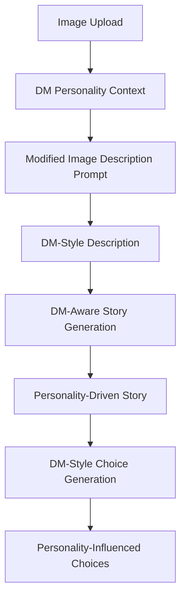

#### 3. DM Template Management
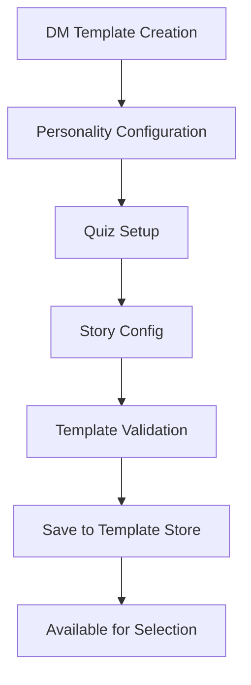

### Integration Points

#### Template System Integration
- **Extended Template Types**: Support for both game and DM templates
- **Template Relationships**: Game templates can reference specific DM templates
- **Template Compatibility**: Version checking and migration for DM templates
- **Template Sharing**: DM templates can be shared independently or with games

#### Story Generation Integration
- **Prompt Modification**: Base prompts modified by DM personality traits
- **Style Injection**: DM communication style applied to all generated content
- **Consistency Maintenance**: DM personality remains consistent across all turns
- **Dynamic Adaptation**: DM can adapt to player choices while maintaining core personality

#### Character Store Integration
- **DM Reference**: Character store tracks active DM template
- **Personality Context**: All story generation includes DM personality context
- **Choice Influence**: DM personality affects choice generation and outcomes
- **Session Persistence**: DM selection persists across game sessions

### UI Components

#### 1. Personality Quiz Interface (`src/components/PersonalityQuiz.tsx`)
- **Multi-Step Quiz**: Progressive disclosure of personality questions
- **Visual Feedback**: Progress indicators and personality previews
- **Result Display**: Clear explanation of matched DM personality
- **Customization Options**: Fine-tune DM personality before game start

#### 2. DM Template Manager (`src/components/DMTemplateManager.tsx`)
- **DM Template Creation**: Interface for creating new DM personalities
- **Personality Configuration**: Tools for setting traits, style, and preferences
- **Quiz Builder**: Interface for creating personality assessment questions
- **Template Preview**: Preview how DM personality affects story generation

#### 3. DM Selection Interface (`src/components/DMSelector.tsx`)
- **DM Gallery**: Browse available DM templates
- **Personality Comparison**: Compare different DM personalities
- **Quick Selection**: Rapid DM selection for experienced users
- **Custom DM Creation**: Create custom DM personalities

### Benefits

#### 1. Personalized Experience
- **Unique Storytelling**: Each DM provides a distinct narrative voice
- **Player Preference Matching**: Quiz ensures DM matches player preferences
- **Replayability**: Different DMs create different experiences with same content
- **Emotional Connection**: Players can form preferences for specific DM personalities

#### 2. Dynamic Content Generation
- **Personality-Driven Stories**: Stories reflect DM's unique perspective
- **Consistent Voice**: DM maintains personality throughout the game
- **Adaptive Responses**: DM can adapt to player choices while staying in character
- **Rich Characterization**: DM becomes a character in the story

#### 3. Enhanced Game Mechanics
- **Personality-Based Choices**: Choices reflect DM's decision-making style
- **Difficulty Scaling**: DM personality can affect game difficulty
- **Mood System**: DM mood can change based on player actions
- **Learning System**: DM can learn from player preferences over time

### Implementation Status

#### 🔄 Phase 1: Core DM System (PLANNED)
- Dungeon Master template schema and validation
- Personality quiz system and scoring algorithm
- Basic DM template integration with existing system
- Comprehensive test coverage

#### 🔄 Phase 2: DM-Aware Generation (PLANNED)
- DM personality integration into story generation
- Personality-driven choice generation
- DM communication style implementation
- Dynamic prompt modification system

#### 🔄 Phase 3: Advanced DM Features (PLANNED)
- DM mood and personality evolution
- Learning system for player preferences
- Advanced personality customization
- DM template sharing and collaboration

#### 🔄 Phase 4: UI Integration (PLANNED)
- Personality quiz interface
- DM template management UI
- DM selection and customization interface
- DM personality preview system

### Technical Considerations

#### Performance
- **Template Caching**: DM templates cached for quick access
- **Prompt Optimization**: Efficient prompt modification without performance impact
- **Memory Management**: Proper cleanup of DM context and personality data

#### Scalability
- **Template Versioning**: Support for DM template evolution
- **Compatibility**: Backward compatibility with existing game templates
- **Extensibility**: Easy addition of new personality traits and styles

#### User Experience
- **Intuitive Quiz**: Simple, engaging personality assessment
- **Clear Results**: Easy-to-understand DM personality matching
- **Customization**: Flexible DM personality adjustment
- **Consistency**: Reliable DM personality throughout the game

---

## Future Directions & Use Cases 

[2025-07-01] **Critical Note:** A key bug was resolved by ensuring all per-turn data (image, description, story, choices) is always mapped to the same turn number. All mapping logic now uses the same turn number for all per-turn data, ensuring the UI and state are always in sync. This is now fully tested and production-ready. Future features must maintain this strict mapping for reliability.

## Dice Roll and Combat System Architecture

### Overview
The dice roll and combat system adds dynamic RPG mechanics to the storytelling experience. Character stats, health, and story outcomes are determined through dice rolls that create meaningful consequences and progression.

### Core Components

#### 1. Dice System (`src/lib/utils/dice.ts`)
- **Roll Functions**: `rollDice(sides: number)`, `rollWithModifier(base: number, modifier: number)`
- **Success Calculation**: `calculateSuccess(roll: number, difficulty: number)`
- **Critical System**: Critical success/failure detection and effects

#### 2. Combat System (`src/lib/utils/combat.ts`)
- **Damage Calculation**: `calculateDamage(attackRoll: number, defense: number)`
- **Health Management**: `applyDamage(character: Character, damage: number)`
- **Death Detection**: `checkDeath(character: Character)`
- **Status Effects**: Poison, healing, temporary buffs/debuffs

#### 3. Character Combat State
```typescript
interface CharacterCombatState {
  health: number;           // 0-200 (0 = dead)
  maxHealth: number;        // Base health capacity
  statusEffects: StatusEffect[];
  combatHistory: CombatEvent[];
  isAlive: boolean;
  lastDamageTaken: number;
}
```

#### 4. Dice Roll Types (`src/lib/types/dice.ts`)
```typescript
interface DiceRoll {
  id: string;
  type: 'combat' | 'skill' | 'saving_throw';
  dice: number;           // Number of dice (e.g., 1d20)
  sides: number;          // Sides per die (e.g., 20)
  modifier: number;       // Stat-based modifier
  result: number;         // Final roll result
  success: boolean;       // Whether roll succeeded
  critical: boolean;      // Critical success/failure
  timestamp: string;
  turnNumber: number;
}
```

### System Flow

#### 1. Story-Dice Integration
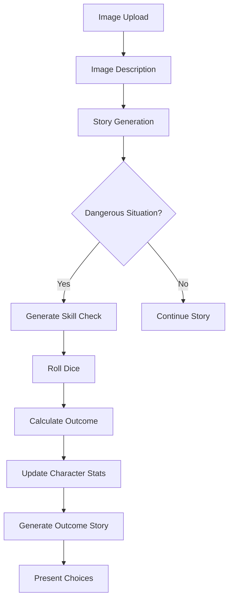

#### 2. Combat Flow
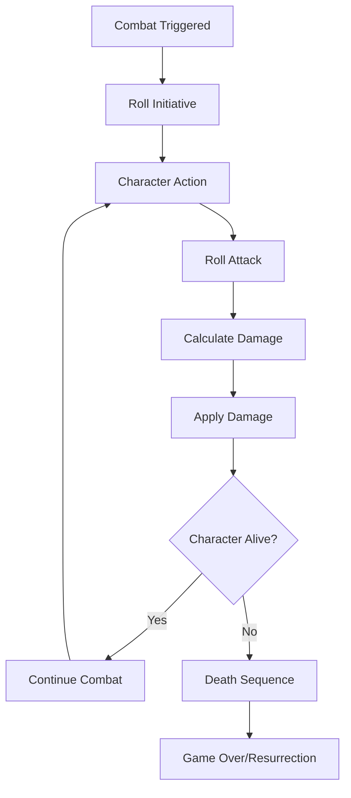

### Integration Points

#### Character Store Integration
- **Health Management**: Real-time health updates and death detection
- **Combat History**: Track all dice rolls and combat events
- **Status Effects**: Manage temporary buffs/debuffs
- **Experience**: Award XP for successful rolls and combat

#### Story Generation Integration
- **Danger Detection**: AI identifies dangerous situations in image descriptions
- **Skill Check Generation**: LLM suggests appropriate skill checks
- **Outcome Integration**: Story outcomes reflect dice roll results
- **Character State**: Stories reference current health and status

#### Choice System Integration
- **Risk Assessment**: Choices consider current health and combat state
- **Combat Choices**: Fight/flee/negotiate options with different risks
- **Stat-Based Success**: Character stats influence choice outcomes
- **Consequence Tracking**: All outcomes affect future story generation

### UI Components

#### 1. Dice Roll Display (`src/components/DiceRoll.tsx`)
- **Visual Dice**: Animated dice roll with sound effects
- **Result Display**: Clear success/failure indication
- **Modifier Breakdown**: Show how stats affected the roll
- **History**: Recent dice rolls and outcomes

#### 2. Health Display (`src/components/HealthBar.tsx`)
- **Health Bar**: Visual health indicator with color coding
- **Status Effects**: Display active buffs/debuffs
- **Combat State**: Show if in combat or safe
- **Death Indicator**: Clear game over state

#### 3. Combat Notifications (`src/components/CombatNotification.tsx`)
- **Damage Popup**: Show damage taken/dealt
- **Critical Hits**: Special effects for critical rolls
- **Status Updates**: Notify of new status effects
- **Death Notification**: Handle character death gracefully

### Template Integration

#### Game Template Type
- **Combat Settings**: Enable/disable combat for different template types
- **Difficulty Scaling**: Adjust dice roll difficulties based on template
- **Starting Health**: Set initial character health
- **Combat Rules**: Customize combat mechanics per template

#### Template Persistence
- **Combat History**: Save all dice rolls and combat events
- **Character State**: Persist health, status effects, and combat state
- **Story Integration**: Include combat outcomes in final story generation
- **Replay Support**: Allow replaying combat scenarios

### Benefits

#### 1. Dynamic Gameplay
- **Unpredictable Outcomes**: Dice rolls create genuine uncertainty
- **Meaningful Consequences**: Health and stats affect story progression
- **Risk Management**: Players must consider their character's state
- **Replayability**: Different outcomes each playthrough

#### 2. Character Development
- **Stat Progression**: Successful rolls improve character abilities
- **Experience System**: Combat and skill checks award XP
- **Status Effects**: Temporary buffs/debuffs add depth
- **Death/Resurrection**: High stakes with recovery mechanics

#### 3. Story Integration
- **Consequential Choices**: Story outcomes reflect character state
- **Combat Narratives**: Rich combat descriptions and outcomes
- **Character Growth**: Stories reflect character progression
- **Tension Building**: Health and status create narrative tension

### Implementation Status

#### 🔄 Phase 1: Core Dice System (PLANNED)
- Dice roll utilities and types
- Basic success/failure calculation
- Critical success/failure detection
- Comprehensive test coverage

#### 🔄 Phase 2: Health & Combat System (PLANNED)
- Health management and damage calculation
- Death detection and resurrection mechanics
- Status effect system
- Combat event tracking

#### 🔄 Phase 3: Story-Dice Integration (PLANNED)
- Danger detection in story generation
- Skill check generation and resolution
- Story outcome integration
- Character state reflection in narratives

#### 🔄 Phase 4: UI Components (PLANNED)
- Dice roll animations and display
- Health bar and status indicators
- Combat notifications
- Death/resurrection UI

#### 🔄 Phase 5: Advanced Features (PLANNED)
- Experience and leveling system
- Inventory items affecting combat
- Advanced status effects
- Multi-character combat

---

## Future Directions & Use Cases 

[2025-07-01] **Critical Note:** The turn number mapping for all per-turn data is now strictly enforced and fully tested. All UI and state logic is guaranteed to be in sync for each turn. This is a critical requirement for all future features. 

## Dynamic Prompt System Architecture

### Overview
The dynamic prompt system creates reactive, character-driven storytelling by injecting game state, character stats, and player choices directly into AI prompts. This system makes every decision meaningful and creates a truly adaptive narrative experience.

### Core Components

#### 1. Dynamic Prompt Templates (`src/lib/prompts/dynamicPrompts.ts`)
```typescript
interface DynamicPromptTemplate {
  id: string;
  name: string;
  type: 'image-description' | 'story-generation' | 'choice-generation' | 'final-story';
  
  // Base prompt with placeholders
  basePrompt: string;
  
  // Placeholder definitions
  placeholders: {
    [key: string]: {
      description: string;
      required: boolean;
      defaultValue?: string;
      validation?: (value: any) => boolean;
    };
  };
  
  // Context requirements
  requiredContext: string[];
  
  // Template metadata
  version: string;
  author?: string;
  tags: string[];
}
```

#### 2. Placeholder System
```typescript
interface PromptContext {
  // Character state
  character: {
    stats: CharacterStats;
    health: number;
    experience: number;
    level: number;
    inventory: Item[];
  };
  
  // Game state
  game: {
    currentTurn: number;
    totalTurns: number;
    storyHistory: StoryEntry[];
    choiceHistory: ChoiceEntry[];
    imageHistory: ImageEntry[];
  };
  
  // DM context
  dm: {
    personality: PersonalityType;
    mood: 'positive' | 'neutral' | 'negative';
    style: string;
  };
  
  // Current context
  current: {
    imageDescription: string;
    previousStory?: string;
    availableChoices?: Choice[];
  };
}
```

#### 3. Prompt Generation Engine
```typescript
class DynamicPromptEngine {
  // Generate prompt with context
  generatePrompt(template: DynamicPromptTemplate, context: PromptContext): string;
  
  // Replace placeholders with actual values
  replacePlaceholders(prompt: string, context: PromptContext): string;
  
  // Validate prompt before generation
  validatePrompt(template: DynamicPromptTemplate, context: PromptContext): boolean;
  
  // Cache generated prompts for performance
  getCachedPrompt(key: string): string | null;
}
```

### Placeholder System

#### Available Placeholders
- **Character Stats**: `{{CHAR_STATS}}`, `{{CHAR_HEALTH}}`, `{{CHAR_LEVEL}}`
- **Game Progress**: `{{CURRENT_TURN}}`, `{{TOTAL_TURNS}}`, `{{STORY_HISTORY}}`
- **DM Context**: `{{DM_PERSONALITY}}`, `{{DM_MOOD}}`, `{{DM_STYLE}}`
- **Current Context**: `{{IMAGE_DESCRIPTION}}`, `{{PREVIOUS_STORY}}`
- **Choice Context**: `{{AVAILABLE_CHOICES}}`, `{{CHOICE_HISTORY}}`
- **Dynamic Elements**: `{{DIFFICULTY_MODIFIER}}`, `{{SUCCESS_CHANCE}}`

#### Placeholder Examples
```typescript
// Character-responsive story generation
const storyPrompt = `
You are {{DM_PERSONALITY}}, a {{DM_STYLE}} Dungeon Master.

Your player character has these stats:
{{CHAR_STATS}}

Current health: {{CHAR_HEALTH}}/{{CHAR_MAX_HEALTH}}
Experience level: {{CHAR_LEVEL}}

Based on this image: {{IMAGE_DESCRIPTION}}

And considering the previous story: {{PREVIOUS_STORY}}

Create a story that:
- Challenges the character's {{WEAKEST_STAT}} ({{WEAKEST_STAT_VALUE}})
- Rewards their {{STRONGEST_STAT}} ({{STRONGEST_STAT_VALUE}})
- Reflects your {{DM_PERSONALITY}} style
- Provides meaningful choices that impact character development

Current turn: {{CURRENT_TURN}} of {{TOTAL_TURNS}}
`;

// Choice generation with consequences
const choicePrompt = `
Based on the story above and the character's current state:

Health: {{CHAR_HEALTH}}/{{CHAR_MAX_HEALTH}}
Previous choices: {{CHOICE_HISTORY}}

Generate 3-4 choices that:
- Consider the character's {{CHAR_STATS}}
- Reflect the consequences of previous choices
- Provide different risk/reward ratios
- Align with the DM's {{DM_PERSONALITY}} style

Each choice should have clear consequences for:
- Character health and stats
- Story progression
- Future available options
`;
```

### System Flow

#### 1. Prompt Generation Flow
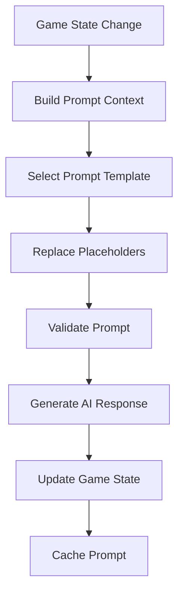

#### 2. Character-Responsive Flow
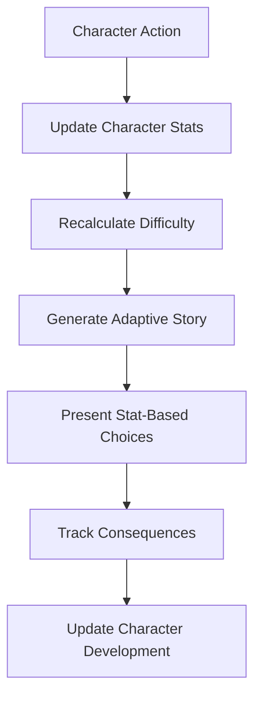

### Integration Points

#### Character Store Integration
- **Real-time Stats**: Character stats immediately affect prompt generation
- **Progression Tracking**: Experience and level changes influence story difficulty
- **Health Management**: Health status affects available choices and story tone
- **Inventory Integration**: Items and equipment modify prompt context

#### Story Generation Integration
- **Adaptive Difficulty**: Story challenges scale with character capabilities
- **Stat-Based Outcomes**: Story results reflect character strengths/weaknesses
- **Progressive Complexity**: Later turns become more challenging
- **Character Development**: Stories acknowledge character growth

#### Choice System Integration
- **Consequence Tracking**: All choices affect future prompt generation
- **Risk Assessment**: Choices consider current character state
- **Stat-Based Success**: Character stats influence choice outcomes
- **Cumulative Effects**: Previous choices impact available options

### Benefits

#### 1. Reactive Storytelling
- **Character-Driven**: Every story element reflects character state
- **Choice Consequences**: Decisions have lasting impact on narrative
- **Progressive Difficulty**: Challenges scale with character development
- **Personalized Experience**: Each playthrough feels unique

#### 2. Enhanced Engagement
- **Meaningful Choices**: Every decision affects character development
- **Stat Impact**: Character stats directly influence story outcomes
- **Consequence Awareness**: Players see the results of their choices
- **Replayability**: Different character builds create different experiences

#### 3. DM Personality Integration
- **Consistent Voice**: DM personality affects all generated content
- **Adaptive Style**: DM can adapt to player choices while maintaining personality
- **Mood System**: DM mood affects story tone and difficulty
- **Learning System**: DM can learn from player preferences

### Implementation Status

#### 🔄 Phase 1: Core Architecture (PLANNED)
- Dynamic prompt template system
- Placeholder replacement engine
- Context building utilities
- Comprehensive test coverage

#### �� Phase 2: Character Integration (PLANNED)
- Character stat integration
- Health and progression tracking
- Stat-based difficulty scaling
- Character development stories

#### 🔄 Phase 3: Choice System Enhancement (PLANNED)
- Consequence tracking system
- Risk assessment integration
- Cumulative choice effects
- Stat-based choice outcomes

#### 🔄 Phase 4: DM Integration (PLANNED)
- DM personality injection
- Mood system implementation
- Adaptive DM responses
- Personality-driven content

#### 🔄 Phase 5: Advanced Features (PLANNED)
- Performance optimization
- Prompt caching system
- Quality assurance tools
- User customization interface

### Technical Considerations

#### Performance
- **Prompt Caching**: Cache generated prompts for repeated use
- **Efficient Replacement**: Optimize placeholder replacement for large templates
- **Context Building**: Minimize context building overhead
- **Memory Management**: Proper cleanup of prompt cache

#### Scalability
- **Template Versioning**: Support for prompt template evolution
- **Context Extensibility**: Easy addition of new context elements
- **Placeholder System**: Flexible placeholder definition and validation
- **Template Sharing**: Share and import prompt templates

#### User Experience
- **Consistent Quality**: Maintain high-quality output across all prompts
- **Predictable Behavior**: Clear relationship between context and output
- **Customization**: Allow users to modify prompt templates
- **Feedback System**: Collect user feedback on prompt quality

---

## Future Directions & Use Cases 

[2025-07-01] **Critical Note:** The turn number mapping for all per-turn data is now strictly enforced and fully tested. All UI and state logic is guaranteed to be in sync for each turn. This is a critical requirement for all future features. 

# Moral Alignment & Dynamic Narrative Architecture (2025-07-02)

## Moral Alignment System
- **Character State:**
  - `moralAlignment: { score: number; level: 'evil'|'villainous'|'neutral'|'good'|'heroic'; reputation: string; recentChoices: string[]; alignmentHistory: {timestamp, choice, impact, newScore}[] }`
  - Score is updated on every choice; level and reputation are derived from score.
  - Recent choices and alignment history are tracked for prompt context and UI.

## Choice-Consequence Matrix
- **Each Choice:**
  - Has a moral impact (numeric), immediate consequence, long-term branch, and win/loss state trigger.
  - Matrix is used in prompt generation and to update game state.
  - Example:
    | Choice | Moral Impact | Immediate | Branch | Win/Loss |
    |--------|--------------|-----------|--------|----------|
    | Help villagers | +10 | Villagers aid you | Redemption | Win+ |
    | Plunder | -15 | Villagers hostile | Tyranny | Loss+ |

## Persistent Narrative State
- **Game State:**
  - Now includes: `moralAlignment`, `currentBranch`, `criticalChoices`, `winLossState`.
  - This state is always passed to the LLM for story/choice generation.

## Prompt Engineering
- **Prompts Always Include:**
  - Alignment score/level, reputation, recent choices, current branch, emotional tone.
  - Ensures LLM output is consistent with player's moral journey and narrative path.

## Win/Loss Conditions
- **Game State:**
  - Win/loss triggers are defined in the choice matrix and tracked in state.
  - When reached, summary and replay encouragement are shown.

## UI Feedback
- **UI Components:**
  - CharacterStats now displays alignment, reputation, and recent choices.
  - Major impacts are highlighted (e.g., "Your reputation as a hero grows!").

## Data Model Updates
- See `src/lib/types/character.ts` for new `moralAlignment` and related types.
- See `src/lib/types/template.ts` and `src/lib/types/partialTemplate.ts` for narrative state and branching.

## Testing & TDD
- All new features are covered by Jest tests.
- Tests ensure correct alignment updates, branching, and prompt context.

## References
- See spec.md for implementation status and next steps.
- See Gemini review (2025-07-02) for rationale and best practices.

# DM Reflection & Adaptation System Architecture (2025-07-02)

## Overview
The DM Reflection & Adaptation System creates a truly dynamic and responsive AI Dungeon Master that reflects on each turn and adapts the game scenario, mechanics, and narrative direction for subsequent turns. This system transforms the DM from a static narrator into an evolving character that learns from player behavior and adjusts the experience accordingly.

## Core Components

### 1. DM Reflection Engine (`src/lib/prompts/dmReflectionPrompts.ts`)
```typescript
interface DMReflectionContext {
  // Current game state
  character: Character;
  currentTurn: number;
  imageDescription: string;
  generatedStory: string;
  playerChoices: Choice[];
  choiceOutcomes: ChoiceOutcome[];
  
  // DM personality and state
  dmPersonality: DungeonMasterTemplate;
  currentMood: 'positive' | 'negative' | 'neutral';
  previousAdaptations: DMAdaptation[];
  
  // Player performance metrics
  playerPerformance: {
    alignmentChange: number;
    choiceQuality: 'good' | 'neutral' | 'poor';
    storyEngagement: number;
    difficultyRating: number;
  };
}

interface DMReflectionResponse {
  reflection: string;
  adaptations: {
    difficultyAdjustment: number;
    narrativeDirection: string;
    moodChange: 'positive' | 'negative' | 'neutral';
    personalityEvolution: string[];
    storyModifications: string[];
  };
  playerAssessment: {
    engagement: number;
    understanding: number;
    satisfaction: number;
  };
}
```

### 2. DM Adaptation State Management (`src/lib/types/dmAdaptation.ts`)
```typescript
interface DMAdaptation {
  id: string;
  turnNumber: number;
  timestamp: string;
  
  // Reflection data
  reflection: string;
  playerPerformance: PlayerPerformanceMetrics;
  
  // Adaptation decisions
  adaptations: {
    difficultyAdjustment: number;        // -10 to +10 scale
    narrativeDirection: string;          // e.g., "darken tone", "increase mystery"
    moodChange: 'positive' | 'negative' | 'neutral';
    personalityEvolution: string[];     // New traits or changes
    storyModifications: string[];       // Specific story changes
  };
  
  // Impact tracking
  impact: {
    storyQuality: number;
    playerEngagement: number;
    narrativeCoherence: number;
  };
}

interface PlayerPerformanceMetrics {
  alignmentChange: number;
  choiceQuality: 'good' | 'neutral' | 'poor';
  storyEngagement: number;              // 0-100 scale
  difficultyRating: number;             // 1-10 scale
  responseTime: number;                 // Average time to make choices
  choiceConsistency: number;            // How consistent choices are
}
```

### 3. DM Reflection API (`src/app/api/dm-reflection/route.ts`)
```typescript
// POST /api/dm-reflection
interface DMReflectionRequest {
  context: DMReflectionContext;
  dmPersonality: DungeonMasterTemplate;
  previousReflections: DMAdaptation[];
}

interface DMReflectionResponse {
  success: boolean;
  reflection: DMReflectionResponse;
  error?: string;
}
```

## System Flow

### 1. DM Reflection Trigger Flow
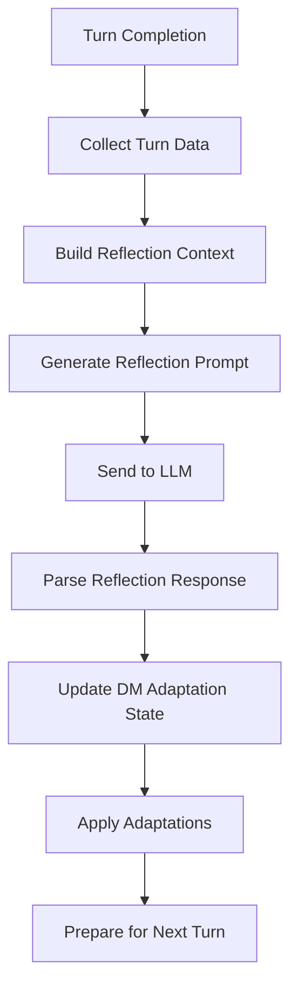

### 2. Adaptive Story Generation Flow
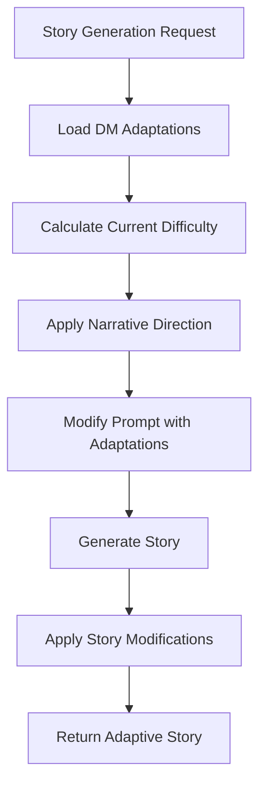

### 3. DM Mood and Personality Evolution
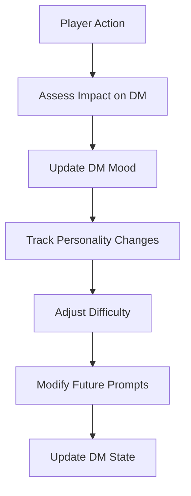

## Integration Points

### Character Store Integration
```typescript
// Extended character store with DM adaptations
interface ExtendedCharacter extends Character {
  dmAdaptations: DMAdaptation[];
  currentDMMood: 'positive' | 'negative' | 'neutral';
  dmPersonalityEvolution: string[];
  difficultyModifier: number;
}

// Store actions for DM adaptations
interface CharacterStore {
  // ... existing actions ...
  addDMAdaptation: (adaptation: DMAdaptation) => void;
  updateDMMood: (mood: 'positive' | 'negative' | 'neutral') => void;
  getCurrentDifficulty: () => number;
  getDMAdaptationsForTurn: (turnNumber: number) => DMAdaptation[];
}
```

### Story Generation Integration
```typescript
// Enhanced story generation with DM adaptations
function buildAdaptiveStoryPrompt({
  character,
  description,
  customPrompt,
  goodVsBadConfig,
  dmAdaptations
}: {
  character: Character;
  description: string;
  customPrompt?: string;
  goodVsBadConfig?: GoodVsBadConfig;
  dmAdaptations: DMAdaptation[];
}) {
  const basePrompt = buildStoryPrompt({ character, description, customPrompt, goodVsBadConfig });
  
  // Apply DM adaptations
  const difficultyModifier = calculateDifficultyModifier(dmAdaptations);
  const narrativeDirection = getCurrentNarrativeDirection(dmAdaptations);
  const moodContext = getDMMoodContext(character.currentDMMood);
  
  return `
${basePrompt}

DM ADAPTATIONS:
Current Difficulty Modifier: ${difficultyModifier}
Narrative Direction: ${narrativeDirection}
DM Mood: ${moodContext}
Recent Adaptations: ${formatRecentAdaptations(dmAdaptations)}

Generate a story that:
- Reflects the current difficulty level (${difficultyModifier > 0 ? 'increased' : 'decreased'} challenge)
- Follows the narrative direction: ${narrativeDirection}
- Matches the DM's current mood: ${moodContext}
- Incorporates lessons learned from previous adaptations
`;
}
```

### Choice Generation Integration
```typescript
// Adaptive choice generation with DM context
function buildAdaptiveChoicePrompt({
  story,
  character,
  dmAdaptations
}: {
  story: string;
  character: Character;
  dmAdaptations: DMAdaptation[];
}) {
  const difficulty = getCurrentDifficulty(character, dmAdaptations);
  const dmMood = character.currentDMMood;
  const personalityTraits = getActivePersonalityTraits(character.dmPersonalityEvolution);
  
  return `
Based on the story above and the DM's current state:

DM CONTEXT:
- Current Mood: ${dmMood}
- Difficulty Level: ${difficulty}/10
- Active Personality Traits: ${personalityTraits.join(', ')}

Generate choices that:
- Reflect the DM's current mood and personality
- Provide appropriate challenge level (${difficulty}/10)
- Consider the player's recent performance and alignment
- Offer meaningful consequences that will affect future adaptations
`;
}
```

## UI Components

### 1. DM Reflection Display (`src/components/DMReflection.tsx`)
```typescript
interface DMReflectionProps {
  adaptation: DMAdaptation;
  isVisible: boolean;
  onClose: () => void;
}

// Displays DM thoughts and adaptations after each turn
```

### 2. DM Mood Indicator (`src/components/DMMoodIndicator.tsx`)
```typescript
interface DMMoodIndicatorProps {
  mood: 'positive' | 'negative' | 'neutral';
  personalityTraits: string[];
  difficultyModifier: number;
}

// Visual indicator of DM's current mood and personality
```

### 3. DM Adaptation History (`src/components/DMAdaptationHistory.tsx`)
```typescript
interface DMAdaptationHistoryProps {
  adaptations: DMAdaptation[];
  onSelectAdaptation: (adaptation: DMAdaptation) => void;
}

// History viewer for reviewing DM adaptations
```

## Performance Considerations

### 1. Reflection Processing
- **Caching:** Cache reflection responses for similar contexts
- **Async Processing:** Process reflections in background to avoid blocking UI
- **Batching:** Batch multiple adaptations for efficiency

### 2. State Management
- **Selective Updates:** Only update relevant parts of DM state
- **Memory Management:** Limit adaptation history to prevent memory bloat
- **Persistence:** Efficient storage and retrieval of adaptation data

### 3. API Optimization
- **Request Batching:** Combine multiple reflection requests
- **Response Caching:** Cache common reflection patterns
- **Error Recovery:** Graceful fallback when reflection fails

## Benefits

### 1. Dynamic Storytelling
- **Adaptive Narratives:** Stories evolve based on player behavior
- **Personalized Experience:** Each playthrough feels unique
- **Engaging AI:** DM becomes a character that reacts and grows

### 2. Balanced Gameplay
- **Automatic Difficulty:** Adjusts challenge based on player performance
- **Mood-Based Content:** Story tone reflects DM's current state
- **Progressive Complexity:** Challenges scale with player development

### 3. Enhanced Engagement
- **Meaningful Consequences:** Player actions directly affect future content
- **DM Personality:** Players can form preferences for specific DM styles
- **Replayability:** Different play styles create different experiences

## Implementation Status

### ✅ Phase 29.1: DM Reflection Prompt System (COMPLETED)
- ✅ Reflection prompt templates and context building
- ✅ Comprehensive test coverage for prompt generation
- ✅ Integration with existing prompt system

### ✅ Phase 29.2: DM Adaptation State Management (COMPLETED)
- ✅ DM adaptation types and interfaces
- ✅ Character store integration for adaptation tracking
- ✅ Persistence and state management

### ✅ Phase 29.3: DM Reflection API Integration (COMPLETED)
- ✅ API endpoint for reflection processing
- ✅ LM Studio integration and response parsing
- ✅ Error handling and fallback mechanisms

### ✅ Phase 29.4: Adaptive Story Generation (COMPLETED)
- ✅ Story generation with DM adaptation context
- ✅ Difficulty scaling and narrative direction
- ✅ Integration with existing story system

### ✅ Phase 29.5: DM Mood and Personality Evolution (COMPLETED)
- ✅ Mood system and personality tracking
- ✅ Mood-based prompt modifications
- ✅ Personality evolution algorithms

### ✅ Phase 29.6: Adaptive Choice Generation (COMPLETED)
- ✅ Choice generation with DM context
- ✅ Difficulty-based choice scaling
- ✅ DM personality influence on choices

### ✅ Phase 29.7: DM Reflection UI Components (COMPLETED)
- ✅ Reflection display and mood indicators
- ✅ Adaptation history viewer
- ✅ DM satisfaction feedback system

### ✅ Phase 29.8: Integration and Testing (COMPLETED)
- ✅ Complete system integration
- ✅ Performance optimization
- ✅ End-to-end testing

### ✅ Phase 29.9: Debug System Implementation (COMPLETED)
- ✅ Comprehensive debug logging across all components
- ✅ API call monitoring and response tracking
- ✅ Performance metrics and timing analysis
- ✅ Error handling and recovery logging

### ✅ Phase 29.10: Production Optimization (COMPLETED)
- ✅ TypeScript/ESLint error resolution
- ✅ Build optimization and performance tuning
- ✅ Full test suite with 418 passing tests
- ✅ Production-ready deployment

## Current System Status (2025-01-27)

### ✅ **Fully Implemented Features**
- **DM Reflection & Adaptation System**: Complete AI DM that reflects on player choices and adapts future content
- **Character Development System**: Comprehensive stats, moral alignment, and progression tracking
- **Template Management**: Save and load game sessions with full state persistence
- **Good vs Bad Framework**: Customizable moral alignment system with configurable themes
- **Debug Logging System**: Comprehensive logging for fine-tuning and troubleshooting
- **Mock Mode Support**: Full functionality testing without external APIs

### ✅ **Technical Achievements**
- **418 Tests Passing**: Comprehensive TDD coverage across all components
- **Production Build**: Optimized build with full TypeScript support
- **Performance Optimized**: Efficient rendering and state management
- **Error Handling**: Robust error recovery and graceful degradation
- **Type Safety**: Strict TypeScript implementation with no `any` types

### ✅ **User Experience Features**
- **Responsive UI**: Modern, accessible interface with real-time feedback
- **Visual Feedback**: Clear indicators for loading states and progress
- **Game Session Management**: Intuitive save/load functionality
- **Debug Tools**: Browser-based debugging and monitoring capabilities

### 🚀 **Ready for Enhancement**
The app now provides a solid foundation for future enhancements:
- Advanced game mechanics (combat, inventory, skill checks)
- Multiplayer support and collaborative storytelling
- Voice integration and audio narration
- Advanced AI features and machine learning integration
- Extended template types and customization options

## Technical Considerations

### Scalability
- **Template Versioning:** Support for DM adaptation evolution
- **Performance Monitoring:** Track reflection processing times
- **Memory Management:** Efficient adaptation data storage

### Reliability
- **Error Handling:** Graceful degradation when reflection fails
- **Fallback Mechanisms:** Default adaptations when LLM unavailable
- **Data Validation:** Ensure adaptation data integrity

### User Experience
- **Non-Intrusive:** Reflections don't interrupt gameplay flow
- **Clear Feedback:** Players understand how their actions affect the DM
- **Consistent Quality:** Maintain high-quality output across adaptations

---

## Future Directions & Use Cases 

[2025-01-27] **Implementation Complete:** The DM Reflection & Adaptation System has been successfully implemented and is fully functional. This system creates truly dynamic and personalized gaming experiences where the AI Dungeon Master becomes an evolving character that learns from and adapts to player behavior. The app is now ready for comprehensive testing, fine-tuning, and future enhancements.

### **Next Development Priorities**
1. **Performance Optimization**: Fine-tune AI response times and caching
2. **User Experience Enhancement**: Improve UI/UX based on user feedback
3. **Advanced Game Mechanics**: Implement combat, inventory, and skill systems
4. **Multiplayer Features**: Add collaborative storytelling capabilities
5. **Voice Integration**: Implement audio narration and voice commands

### **Long-term Vision**
- **AI Evolution**: Advanced machine learning for more sophisticated DM behavior
- **Cross-Platform Support**: Mobile and desktop applications
- **Community Features**: Template sharing and collaborative content creation
- **Educational Applications**: Learning tools and creative writing aids

---

# Tournament System & Battle Replay Architecture (2025-07-12)

## Folder Structure
- `public/Fighters/`: User-uploaded fighter images
- `public/Arena/`: User-uploaded arena images
- `public/tournaments/`: Stores all completed battle logs as JSON files (e.g., `godzilla-vs-brucelee.json`)

## Tournament Generation
- The app scans `Fighters/` and `Arena/` to generate all possible battle matchups.
- Each battle is simulated using the core battle logic.
- After each battle, the log is saved in `public/tournaments/` for replay.
- Tournament results and score charts are generated and stored/displayed.

## Tournament Automation System (2025-01-27)
- **Automate Match Execution**: Button that runs all tournament matches sequentially with a 1-second delay between matches.
- **Real-time Status Tracking**: Uses `currentTournamentRef` to track the latest tournament state during automation.
- **Graceful Completion**: Automation automatically stops when:
  - Tournament status becomes 'completed'
  - No more pending matches are found
  - API returns "No pending matches found" error
- **UI State Management**: Spinner and cancel button disappear immediately upon tournament completion.
- **Error Handling**: Robust error handling for invalid matches, missing fighters, and API failures.

### Automation Flow
1. User clicks "Automate Match Execution"
2. System checks for next pending match
3. Executes match via API
4. Updates tournament state via `onTournamentUpdated` callback
5. Updates `currentTournamentRef` with latest tournament data
6. Checks if tournament is complete or no more matches
7. Continues loop or stops automation
8. UI updates to show completion state

### Technical Implementation
```typescript
// TournamentControls.tsx - Automation Loop
const handleAutomateMatches = async () => {
  setIsAutomating(true);
  automatingRef.current = true;
  
  try {
    while (automatingRef.current) {
      const nextMatch = getNextMatch();
      if (!nextMatch) break;
      
      const success = await executeMatch();
      if (!success) break; // Tournament completed
      
      // Check updated tournament status
      if (currentTournamentRef.current.status === 'completed') {
        break;
      }
      
      await new Promise(resolve => setTimeout(resolve, 1000));
    }
  } finally {
    setIsAutomating(false);
    automatingRef.current = false;
  }
};
```

## Tournament Page & Replay
- New page (e.g., `/tournament`) displays:
  - Tournament bracket or list of battles
  - Score chart for all fighters
  - Dropdown/list to select and replay any completed battle
- When a user selects a battle, the app loads the corresponding JSON log from `public/tournaments/` and replays it in the UI.
- After a replay, the user can select another battle or upload new fighters/arenas.

## Technical Notes
- All battle logs are stored in a portable, human-readable JSON format for easy sharing and debugging.
- The system is extensible for future tournament types (e.g., elimination, round-robin, custom rules).
- Demo battles (e.g., Godzilla vs Bruce Lee) are included as sample tournament logs.
- The UI must be robust for any number of fighters/arenas and provide a seamless replay experience.
- Battle logs in `public/tournaments/` are now saved with a unique filename for each battle, including the date and time, e.g. `godzilla-vs-brucelee-in-tokyoarena-20240713-153012.json`.
- This prevents overwriting previous battles and allows full replay history, even for rematches in the same arena.
- The filename format is: `[fighterA]-vs-[fighterB]-in-[arena]-[YYYYMMDD]-[HHMMSS].json`

---

# Architecture Addendum (2025-06-24)

## 1. Per-Fighter JSON Metadata & Match History
- For every image in `public/vs/fighters/`, there is a JSON file (same basename) with:
  - `id`, `name`, `image` (filename), `stats` (object), `matchHistory` (array of objects)
- Example: `public/vs/fighters/darth-vader.json`
- Used for:
  - Displaying stats in UI
  - Tracking matchups (to avoid duplicate battles)
  - Feeding data to balancing script

## 2. On-Demand Balancing Script
- Script lives in `/scripts/balanceFighters.ts` (or similar)
- Reads all fighter JSON files, uses LLM or logic to adjust stats
- Updates JSON files in place
- UI trigger: Button on `/playervs` (visible only in dev)
- Never runs in production

## 3. UI/UX for Choosing Existing Fighters/Arenas
- Component: `<ChooseExistingFighter />` and `<ChooseExistingArena />`
- Fetches list of images and metadata from API route (e.g., `/api/list-fighters`)
- Renders grid of thumbnails (with stats)
- Selection updates parent state (sets fighter/arena)
- Accessible: Keyboard navigation, focus ring, ARIA labels

---

## 4. Tournament Page Improvements
- The tournament page now always displays the battle dropdown and replay viewer at the top, regardless of which tab (Leaderboard or Battle Replay) is active.
- Users can view the leaderboard and instantly select and watch any past battle without switching tabs.

## Tournament Page Layout & Leaderboard Redesign
- The tournament page now uses a responsive two-column layout (CSS grid/flexbox) to maximize horizontal and vertical space.
- The leaderboard is given more width and improved column spacing for better readability.
- The left column contains the hub, battle dropdown, and leaderboard; the right column is dedicated to the battle replay.
- The design adapts to different screen sizes and ensures all leaderboard columns are visible.
- Motivation: Addressed user feedback about wasted space and poor leaderboard visibility.

## Fighter Stat System Update (2025-07-13)

- Fighter stats now include:
  - health (0-2000 for legendary monsters, 10-120 for others)
  - strength (1-200 for legendary monsters, 1-40 for others)
  - agility (1-60 for all fighters)
  - defense (1-100 for legendary monsters, 1-20 for others)
  - luck (1-30 for all fighters)
  - magic (1-20, optional; for Force, magic, superpowers)
  - ranged (1-100 for legendary monsters, 1-10 for others)
  - intelligence (1-30 for all fighters)
  - uniqueAbilities (string[], optional; e.g., ["Force Choke", "Atomic Breath"])

### Stat Balancing Principles
- **Legendary Monsters** (Godzilla): Can have stats above 100, health up to 2000, strength up to 200
- **Peak Humans** (Bruce Lee, Victor Moreau): Top stats in 30-40 range, health 80-120
- **Animals**: High agility (mouse: 60), moderate strength (shark: 20), low health/defense
- **Magic/Ranged**: Only for those with supernatural or ranged abilities
- **Luck**: Allows for "miracle" upsets but shouldn't break logic

### Updated Fighter Stats (Balanced)

| Fighter         | Health | Strength | Agility | Defense | Luck | Magic | Ranged | Intelligence | Unique Abilities                |
|-----------------|--------|----------|---------|---------|------|-------|--------|-------------|---------------------------------|
| Godzilla        | 2000   | 200      | 2       | 100     | 10   | 0     | 100    | 8           | Atomic Breath, Tail Whip        |
| Bruce Lee       | 100    | 35       | 40      | 15      | 20   | 0     | 5      | 30          | One-Inch Punch, Jeet Kune Do    |
| Brown Field Mouse| 20    | 1        | 60      | 3       | 30   | 0     | 0      | 2           | Quick Escape                    |
| Great White Shark| 60    | 20       | 25      | 10      | 10   | 0     | 5      | 5           | Bite Attack, Blood Frenzy       |
| Victor Moreau   | 80     | 18       | 30      | 12      | 15   | 0     | 2      | 25          | Aikido Throw, Iron Palm         |

### Fighter Stat Balancing Workflow (2024-07-13)
- When a fighter is uploaded or generated:
  - The API first searches all JSON files in `public/vs/fighters/` for a case-insensitive name match.
  - If a match is found, the stats from that JSON file are used for the new fighter (ensuring fair, lore-accurate stats for iconic or previously-uploaded fighters).
  - If no match is found, the API falls back to the current stat generation logic (using LLM or archetype-based rules).
- This ensures that iconic fighters like Bruce Lee, Godzilla, etc. always get the correct stats, and prevents random/weak stat assignments for known characters.

## Playwright End-to-End (E2E) Testing

### Rationale
- Playwright provides true E2E testing by automating browsers and simulating real user actions.
- E2E tests complement Jest unit/component tests, ensuring both logic and user flows are robust.
- Use Playwright to catch integration bugs, regressions, and cross-browser issues.

### How Playwright Fits In
- Jest: fast unit/component tests for logic and isolated UI.
- Playwright: E2E tests for full user flows (upload, fight, rebalance, error handling, etc.).
- Next.js: Playwright works seamlessly with Next.js apps (SSR, routing, API routes).

### Install & Setup
1. Install Playwright and test runner:
   ```bash
   npm install --save-dev playwright @playwright/test
   npx playwright install
   ```
2. Add `playwright.config.ts` to project root:
   ```ts
   import { defineConfig, devices } from '@playwright/test';
   export default defineConfig({
     testDir: './e2e',
     timeout: 30_000,
     retries: 0,
     use: {
       baseURL: 'http://localhost:3000',
       headless: true,
       trace: 'on-first-retry',
     },
     projects: [
       { name: 'chromium', use: { ...devices['Desktop Chrome'] } },
       { name: 'firefox', use: { ...devices['Desktop Firefox'] } },
       { name: 'webkit', use: { ...devices['Desktop Safari'] } },
     ],
   });
   ```
3. Directory structure:
   - Place E2E tests in `e2e/` (e.g., `e2e/playervs.spec.ts`).

### Running Playwright
- Run all tests: `npx playwright test`
- Run a specific test: `npx playwright test e2e/playervs.spec.ts`
- Run in headed mode: `npx playwright test --headed`

### Best Practices
- Use TDD: write a failing E2E test for a user flow, then implement/fix, then refactor.
- Use Playwright's selectors and built-in waits to avoid flakiness.
- Keep E2E tests focused on user-visible behavior, not internals.
- Maintain both Jest and Playwright suites for full coverage.
- Integrate Playwright into CI to catch regressions before merging/deploying.

### CI Integration
- Add Playwright to your CI pipeline (GitHub Actions, etc.) to run E2E tests on every PR/merge.

## 2025-07-14: Battle Layout & UI Enhancements

### New UI/UX Requirements
- **Round History Commentary:** The round history panel must now display the same commentary shown in the left/right fighter panels for each round, with a small avatar for each fighter.
- **Fighter Panel Readability:** Fighter name and health text must be clearly visible (high contrast) and much larger for readability.
- **Panel Spacing:** All battle panels must have increased margin or padding to ensure text is not close to the edges, improving the visual appeal and user experience.

### TDD Enforcement
- All UI/UX changes must follow strict TDD: write failing tests for each requirement, implement minimal code to pass, refactor, and verify all tests/builds pass before commit.

---

# Fighter Stat Display & Battle Integration Architecture (2025-01-27)

## Overview
The Fighter Stat Display & Battle Integration system enhances the fighting game by providing comprehensive stat visibility and integrating unique abilities into battle mechanics. This system ensures players can see all fighter capabilities and experience strategic depth through sparing ability usage.

## Core Components

### 1. Fighter Stat Display System (`src/components/fighting/FighterStatDisplay.tsx`)
```typescript
interface FighterStatDisplayProps {
  fighter: FighterData;
  showAbilities?: boolean;
  showTooltips?: boolean;
  size?: 'compact' | 'detailed' | 'full';
  comparisonMode?: boolean;
}

interface StatDisplayConfig {
  stat: keyof FighterStats;
  label: string;
  color: string;
  range: [number, number];
  showProgressBar: boolean;
  tooltip?: string;
}
```

### 2. Unique Ability System (`src/lib/utils/uniqueAbilities.ts`)
```typescript
interface UniqueAbility {
  id: string;
  name: string;
  description: string;
  activationCondition: AbilityCondition;
  effect: AbilityEffect;
  cooldown: number;
  maxUses: number;
  rarity: 'common' | 'rare' | 'legendary';
}

interface AbilityCondition {
  type: 'health_threshold' | 'luck_roll' | 'opponent_vulnerable' | 'combo_trigger';
  value: number;
  probability: number; // 0.05 to 0.15 for sparing usage
}

interface AbilityEffect {
  type: 'damage_multiplier' | 'status_effect' | 'healing' | 'defense_boost';
  value: number;
  duration?: number;
  target: 'self' | 'opponent' | 'both';
}
```

### 3. Battle Integration Engine (`src/lib/utils/battleAbilityEngine.ts`)
```typescript
interface BattleAbilityContext {
  fighter: FighterData;
  opponent: FighterData;
  currentHealth: number;
  roundNumber: number;
  previousAbilitiesUsed: string[];
  battlePhase: 'opening' | 'mid_battle' | 'climax' | 'desperate';
}

class BattleAbilityEngine {
  // Check if ability should activate
  shouldActivateAbility(ability: UniqueAbility, context: BattleAbilityContext): boolean;
  
  // Apply ability effects to battle
  applyAbilityEffect(ability: UniqueAbility, context: BattleAbilityContext): BattleEffect;
  
  // Generate ability-specific narration
  generateAbilityNarration(ability: UniqueAbility, effect: BattleEffect): string;
  
  // Track ability usage and cooldowns
  updateAbilityState(ability: UniqueAbility, context: BattleAbilityContext): void;
}
```

## System Flow

### 1. Stat Display Flow
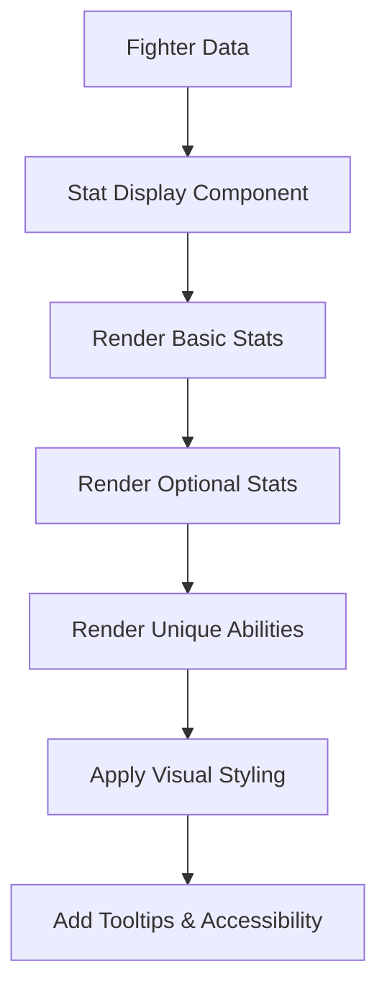

### 2. Ability Integration Flow
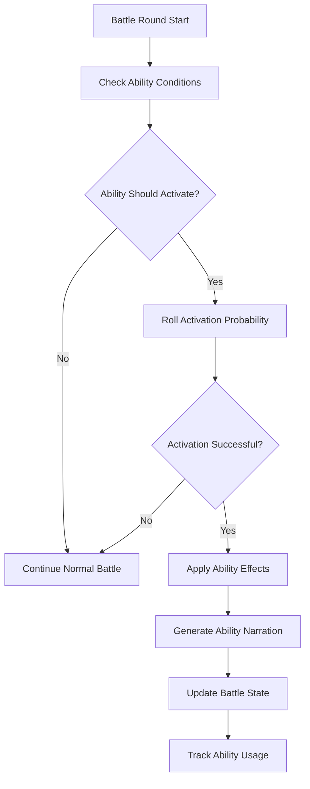

### 3. Sparing Usage Logic
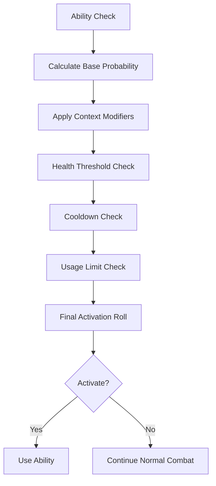

## Integration Points

### Fighter Selection Integration
```typescript
// Enhanced fighter selection with ability preview
interface EnhancedFighterCardProps {
  fighter: FighterData;
  showAbilities: boolean;
  onSelect: (fighter: FighterData) => void;
}

// Ability preview component
const AbilityPreview: React.FC<{ abilities: UniqueAbility[] }> = ({ abilities }) => {
  return (
    <div className="ability-preview">
      {abilities.map(ability => (
        <div key={ability.id} className="ability-badge">
          <span className="ability-name">{ability.name}</span>
          <span className="ability-rarity">{ability.rarity}</span>
          <span className="ability-description">{ability.description}</span>
        </div>
      ))}
    </div>
  );
};
```

### Battle System Integration
```typescript
// Enhanced battle round with ability integration
interface EnhancedBattleRound {
  roundNumber: number;
  fighterA: FighterData;
  fighterB: FighterData;
  healthA: number;
  healthB: number;
  abilityActivations: AbilityActivation[];
  narration: string;
}

interface AbilityActivation {
  fighterId: string;
  abilityId: string;
  effect: BattleEffect;
  narration: string;
  timestamp: string;
}
```

### UI Component Integration
```typescript
// Enhanced battle storyboard with ability events
const EnhancedBattleStoryboard: React.FC<{ battle: EnhancedBattleRound }> = ({ battle }) => {
  return (
    <div className="battle-storyboard">
      {battle.abilityActivations.map(activation => (
        <div key={activation.timestamp} className="ability-event">
          <div className="ability-indicator">
            <span className="ability-name">{activation.abilityId}</span>
            <span className="ability-effect">{activation.effect.type}</span>
          </div>
          <div className="ability-narration">{activation.narration}</div>
        </div>
      ))}
    </div>
  );
};
```

## Ability Examples

### Sith Lord Abilities
```typescript
const sithLordAbilities: UniqueAbility[] = [
  {
    id: 'force_lightning',
    name: 'Force Lightning',
    description: 'Channels dark side energy into devastating lightning attack',
    activationCondition: {
      type: 'health_threshold',
      value: 0.5, // 50% health or higher
      probability: 0.12 // 12% chance per round
    },
    effect: {
      type: 'damage_multiplier',
      value: 2.5,
      target: 'opponent'
    },
    cooldown: 3,
    maxUses: 2,
    rarity: 'legendary'
  },
  {
    id: 'force_choke',
    name: 'Force Choke',
    description: 'Telekinetically constricts opponent\'s airway',
    activationCondition: {
      type: 'luck_roll',
      value: 18, // High luck required
      probability: 0.08 // 8% chance per round
    },
    effect: {
      type: 'status_effect',
      value: 0.3, // 30% damage over time
      duration: 2,
      target: 'opponent'
    },
    cooldown: 4,
    maxUses: 1,
    rarity: 'rare'
  }
];
```

### Peak Human Abilities
```typescript
const peakHumanAbilities: UniqueAbility[] = [
  {
    id: 'one_inch_punch',
    name: 'One-Inch Punch',
    description: 'Bruce Lee\'s devastating close-range technique',
    activationCondition: {
      type: 'combo_trigger',
      value: 3, // After 3 consecutive hits
      probability: 0.15 // 15% chance per round
    },
    effect: {
      type: 'damage_multiplier',
      value: 3.0,
      target: 'opponent'
    },
    cooldown: 2,
    maxUses: 3,
    rarity: 'rare'
  }
];
```

## Performance Considerations

### Stat Display Performance
- **Lazy Loading**: Load ability descriptions only when needed
- **Memoization**: Cache stat calculations and ability effects
- **Virtual Scrolling**: For large fighter lists with detailed stats

### Battle Integration Performance
- **Efficient Probability Calculation**: Use pre-calculated probability tables
- **Ability State Caching**: Cache ability usage and cooldown states
- **Minimal DOM Updates**: Batch ability effect updates

### Memory Management
- **Ability Pool**: Reuse ability objects to reduce memory allocation
- **State Cleanup**: Clear ability states between battles
- **Event Cleanup**: Remove ability event listeners properly

## Benefits

### Enhanced User Experience
- **Complete Information**: Players see all fighter capabilities at a glance
- **Strategic Depth**: Unique abilities add tactical considerations
- **Visual Appeal**: Rich stat displays with color coding and icons
- **Accessibility**: Screen reader support for all stat information

### Gameplay Enhancement
- **Sparing Usage**: Abilities activate rarely to maintain balance
- **Strategic Timing**: Abilities require specific conditions to activate
- **Narrative Integration**: Abilities enhance battle storytelling
- **Replayability**: Different ability activations create varied experiences

### Technical Benefits
- **Type Safety**: Strict typing for all ability types and effects
- **Extensibility**: Easy to add new abilities and fighter types
- **Testability**: Comprehensive test coverage for all ability mechanics
- **Performance**: Optimized for smooth battle experience

## Implementation Status

### ✅ **Phase 30.1: Enhanced Fighter Generation (COMPLETED)**
- Enhanced LLM client with special stats and abilities
- Fighter generation API with comprehensive stat generation
- Fallback logic for ability generation
- **Commit:** `feat(fighting): enhance fighter generation with special stats and abilities`

### ✅ **Phase 30.2: Unified Fighter Stat Display (COMPLETED)**
- Battle setup area uses comprehensive FighterStatDisplay component
- Added onRemove functionality for battle setup
- Consistent experience across all UI areas
- **Commit:** `fix(ui): ensure new fighters display all stats including special stats and abilities`

### ✅ **Phase 30.3: WinnerAnimation Modal Layout Improvements (COMPLETED)**
- Fixed header section with winner announcement and fighter stats
- Scrollable battle overview in middle section
- Fixed footer section with action buttons
- **Commit:** `feat(ui): restructure WinnerAnimation modal for better UX`

### ✅ **Phase 30.4: Enhanced Fighter Descriptions (COMPLETED)**
- Truncated descriptions with hover functionality
- Battle-focused bios with famous person recognition
- Enhanced analysis prompts for better descriptions
- **Commit:** `feat(fighting): enhance fighter descriptions with truncation and famous person recognition`

### ✅ **Phase 30.5: Compelling Character-Specific Bios (COMPLETED)**
- Enhanced fighter analysis with comprehensive data integration
- API integration for enhanced description generation
- Rich character context with personality and fighting style
- **Commit:** `feat(fighting): implement compelling character-specific fighter bios with comprehensive data integration`

### 🔄 Phase 31: Battle Integration of Unique Abilities (PLANNED)
- Unique ability battle system with activation logic
- Ability activation conditions and effects
- Battle narration integration for ability events
- Sparing ability usage with strategic timing

### 🔄 Phase 32: Arena Environmental Effects (PLANNED)
- Arena analysis system with environmental feature detection
- Environmental battle mechanics with object interactions
- Arena description generation for battle replays
- Environmental UI integration in battle display

---

# Arena Environmental Effects & Battle Replay Architecture (2025-01-27)

## Overview
The Arena Environmental Effects & Battle Replay system enhances the fighting game by incorporating arena surroundings into battle mechanics and providing rich, contextual battle replays. This system analyzes arena environments, integrates environmental objects into combat, and generates entertaining arena descriptions for enhanced replay experiences.

## Core Components

### 1. Arena Analysis System (`src/lib/utils/arenaAnalysis.ts`)
```typescript
interface ArenaAnalysis {
  arenaType: 'restaurant' | 'warehouse' | 'outdoor' | 'gym' | 'street' | 'office' | 'other';
  environmentalObjects: EnvironmentalObject[];
  hazards: Hazard[];
  tacticalFeatures: TacticalFeature[];
  atmosphere: string;
  lighting: 'bright' | 'dim' | 'dark';
  size: 'small' | 'medium' | 'large';
}

interface EnvironmentalObject {
  id: string;
  name: string;
  type: 'furniture' | 'structure' | 'weapon' | 'cover' | 'hazard';
  position: { x: number; y: number };
  usable: boolean;
  effects: EnvironmentalEffect[];
  description: string;
}

interface EnvironmentalEffect {
  type: 'damage_boost' | 'defense_boost' | 'mobility_boost' | 'status_effect';
  value: number;
  condition: string;
  target: 'attacker' | 'defender' | 'both';
}
```

### 2. Environmental Battle Mechanics (`src/lib/utils/environmentalEffects.ts`)
```typescript
interface EnvironmentalInteraction {
  fighterId: string;
  objectId: string;
  action: 'use' | 'throw' | 'dodge_behind' | 'climb' | 'break';
  effect: EnvironmentalEffect;
  narration: string;
  roundNumber: number;
}

class EnvironmentalBattleEngine {
  // Check if environmental interaction is possible
  canInteractWithObject(fighter: FighterData, object: EnvironmentalObject): boolean;
  
  // Apply environmental effects to battle
  applyEnvironmentalEffect(interaction: EnvironmentalInteraction, context: BattleContext): BattleEffect;
  
  // Generate environmental interaction narration
  generateEnvironmentalNarration(interaction: EnvironmentalInteraction): string;
  
  // Track environmental object usage and availability
  updateEnvironmentalState(interaction: EnvironmentalInteraction): void;
}
```

### 3. Arena Description Generation (`src/lib/prompts/arenaPrompts.ts`)
```typescript
interface ArenaDescriptionContext {
  arenaAnalysis: ArenaAnalysis;
  fighters: [FighterData, FighterData];
  battlePhase: 'setup' | 'mid_battle' | 'climax';
  environmentalInteractions: EnvironmentalInteraction[];
}

interface ArenaDescription {
  shortDescription: string; // 1-2 sentences for replay display
  detailedDescription: string; // Longer description for battle setup
  environmentalHighlights: string[]; // Key environmental features
  atmosphere: string; // Mood and tone of the arena
}
```

## System Flow

### 1. Arena Analysis Flow
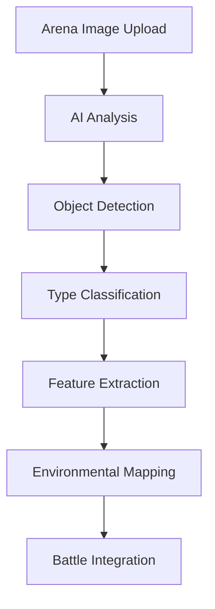

### 2. Environmental Battle Integration
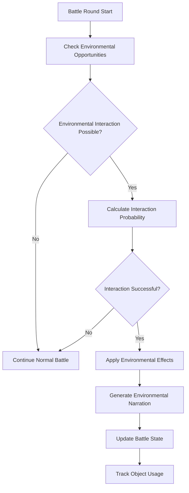

### 3. Battle Replay Enhancement
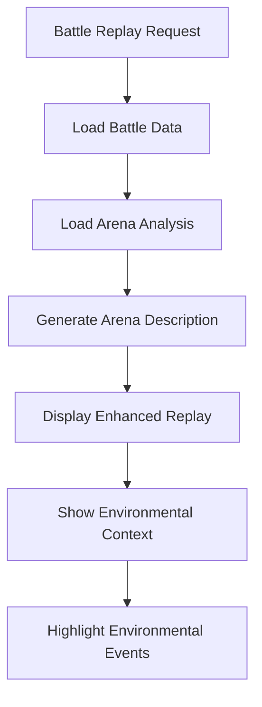

## Integration Points

### Battle System Integration
```typescript
// Enhanced battle round with environmental context
interface EnhancedBattleRound {
  roundNumber: number;
  fighterA: FighterData;
  fighterB: FighterData;
  arena: ArenaAnalysis;
  environmentalInteractions: EnvironmentalInteraction[];
  arenaDescription: ArenaDescription;
  narration: string;
}

// Environmental interaction tracking
interface EnvironmentalBattleLog {
  battleId: string;
  arenaId: string;
  interactions: EnvironmentalInteraction[];
  arenaDescription: ArenaDescription;
  environmentalNarration: string[];
}
```

### UI Component Integration
```typescript
// Enhanced battle viewer with arena descriptions
const EnhancedBattleViewer: React.FC<{ battle: EnhancedBattleRound }> = ({ battle }) => {
  return (
    <div className="battle-viewer">
      <div className="arena-section">
        
        <div className="arena-description">
          <h4>Arena</h4>
          <p>{battle.arenaDescription.shortDescription}</p>
        </div>
      </div>
      
      <div className="environmental-events">
        {battle.environmentalInteractions.map(interaction => (
          <div key={interaction.id} className="environmental-event">
            <span className="event-icon">🌍</span>
            <span className="event-narration">{interaction.narration}</span>
          </div>
        ))}
      </div>
    </div>
  );
};
```

## Environmental Examples

### Restaurant Arena
```typescript
const restaurantArena: ArenaAnalysis = {
  arenaType: 'restaurant',
  environmentalObjects: [
    {
      id: 'chair_1',
      name: 'Wooden Chair',
      type: 'furniture',
      usable: true,
      effects: [
        {
          type: 'damage_boost',
          value: 1.5,
          condition: 'thrown',
          target: 'attacker'
        }
      ],
      description: 'A sturdy wooden chair that can be used as a weapon or shield'
    },
    {
      id: 'table_1',
      name: 'Heavy Table',
      type: 'structure',
      usable: true,
      effects: [
        {
          type: 'defense_boost',
          value: 2.0,
          condition: 'dodge_behind',
          target: 'defender'
        }
      ],
      description: 'A solid table providing excellent cover from attacks'
    }
  ],
  atmosphere: 'Cozy but dangerous - the warm lighting belies the brutal combat within',
  lighting: 'dim',
  size: 'medium'
};
```

### Warehouse Arena
```typescript
const warehouseArena: ArenaAnalysis = {
  arenaType: 'warehouse',
  environmentalObjects: [
    {
      id: 'crate_1',
      name: 'Wooden Crate',
      type: 'structure',
      usable: true,
      effects: [
        {
          type: 'mobility_boost',
          value: 1.3,
          condition: 'climb',
          target: 'attacker'
        }
      ],
      description: 'A stackable crate that can be used for elevation advantage'
    }
  ],
  atmosphere: 'Industrial and unforgiving - every surface is a potential weapon',
  lighting: 'dim',
  size: 'large'
};
```

## Arena Description Examples

### Restaurant Battle Description
```
"The cozy restaurant's warm lighting and rustic charm provide a stark contrast to the brutal combat unfolding within. Wooden chairs become improvised weapons, while heavy tables offer strategic cover - this is no ordinary dining experience."
```

### Warehouse Battle Description
```
"Amidst towering stacks of crates and industrial machinery, the warehouse transforms into a deadly playground. Every surface is a potential weapon, every shadow a tactical advantage in this unforgiving industrial arena."
```

## Performance Considerations

### Arena Analysis Performance
- **Efficient Object Detection**: Use optimized AI models for environmental feature extraction
- **Caching**: Cache arena analysis results to avoid repeated processing
- **Lazy Loading**: Load environmental data only when needed

### Battle Integration Performance
- **Interaction Calculation**: Pre-calculate possible environmental interactions
- **State Management**: Efficient tracking of environmental object availability
- **Memory Optimization**: Minimize memory usage for environmental data

### Replay Performance
- **Description Caching**: Cache generated arena descriptions
- **Event Streaming**: Stream environmental events for large battle replays
- **Visual Optimization**: Efficient rendering of environmental effects

## Benefits

### Enhanced Gameplay
- **Environmental Strategy**: Players must consider arena surroundings in battle planning
- **Tactical Depth**: Environmental objects provide new combat options
- **Variety**: Different arenas create different tactical challenges
- **Realism**: Environmental interactions make battles more believable

### Improved Replay Experience
- **Contextual Information**: Arena descriptions provide battle context
- **Environmental Storytelling**: Environmental events enhance battle narratives
- **Visual Enhancement**: Arena descriptions improve replay visual appeal
- **Educational Value**: Players learn about environmental tactics

### Technical Benefits
- **Extensibility**: Easy to add new arena types and environmental objects
- **Scalability**: System can handle complex arena environments
- **Maintainability**: Well-structured code for environmental mechanics
- **Testability**: Comprehensive test coverage for all environmental features

---

## Future Directions & Use Cases

[2025-01-27] **Implementation Ready:** The Arena Environmental Effects & Battle Replay system is designed to create more immersive and strategic battles by incorporating arena surroundings into combat mechanics. This system will provide rich, contextual battle experiences with environmental storytelling and enhanced replay functionality.

# Fighting Game Architecture: Rich Interconnected Narrative System

## Overview

This document outlines the architecture for a rich, interconnected narrative system where fighters, arenas, and tournaments create a living, evolving world with persistent history and dynamic interactions.

## Core Principles

1. **Persistent Fighter History**: Every fighter maintains a complete record of battles, tournaments, slogans, and achievements
2. **Dynamic Arena Interactions**: Arenas provide tactical elements that fighters can use during battles
3. **Evolving Tournament Narratives**: Tournament commentary references fighter history and creates ongoing storylines
4. **Interconnected Prompts**: All AI-generated content references and builds upon previous events

## Data Architecture

### Fighter History System

```typescript
interface FighterHistory {
  // Core fighter data
  fighterId: string;
  name: string;
  createdAt: Date;
  
  // Battle statistics
  totalBattles: number;
  wins: number;
  losses: number;
  draws: number;
  winRate: number;
  
  // Tournament performance
  tournamentsEntered: number;
  tournamentsWon: number;
  bestTournamentPlacement: number;
  totalTournamentMatches: number;
  
  // Combat statistics
  totalDamageDealt: number;
  totalDamageTaken: number;
  averageDamagePerRound: number;
  quickestVictory: number; // rounds
  longestBattle: number; // rounds
  mostDamagingAttack: number;
  
  // Narrative elements
  slogans: FighterSlogan[];
  catchphrases: string[];
  memorableQuotes: string[];
  fightingStyle: string;
  styleEvolution: StyleEvolution[];
  
  // Battle history
  battleHistory: BattleRecord[];
  tournamentHistory: TournamentRecord[];
  
  // Relationships and rivalries
  rivals: string[]; // fighter IDs
  allies: string[]; // fighter IDs
  crowdReactions: CrowdReaction[];
}

interface FighterSlogan {
  id: string;
  slogan: string;
  context: 'battle' | 'tournament' | 'slideshow' | 'victory' | 'defeat';
  battleId?: string;
  tournamentId?: string;
  createdAt: Date;
  popularity: number; // crowd reaction score
}

interface BattleRecord {
  battleId: string;
  opponent: string;
  result: 'win' | 'loss' | 'draw';
  rounds: number;
  damageDealt: number;
  damageTaken: number;
  arena: string;
  date: Date;
  notableMoments: string[];
  slogansUsed: string[];
  crowdReactions: string[];
}

interface TournamentRecord {
  tournamentId: string;
  tournamentName: string;
  placement: number;
  totalParticipants: number;
  matchesPlayed: number;
  matchesWon: number;
  date: Date;
  arena: string;
  memorableMoments: string[];
  slogansCreated: string[];
}
```

### Arena Interaction System

```typescript
interface ArenaData {
  id: string;
  name: string;
  description: string;
  type: 'indoor' | 'outdoor' | 'urban' | 'natural' | 'fantasy';
  
  // Tactical elements
  interactiveObjects: ArenaObject[];
  hazards: ArenaHazard[];
  advantages: ArenaAdvantage[];
  coverPoints: CoverPoint[];
  
  // Environmental conditions
  lighting: 'bright' | 'dim' | 'dark' | 'variable';
  weather: 'clear' | 'rain' | 'fog' | 'storm';
  terrain: 'flat' | 'uneven' | 'slippery' | 'rough';
  
  // Battle modifiers
  damageMultipliers: Record<string, number>;
  movementModifiers: Record<string, number>;
  specialEvents: ArenaEvent[];
}

interface ArenaObject {
  id: string;
  name: string;
  type: 'weapon' | 'cover' | 'hazard' | 'advantage';
  description: string;
  damagePotential: number;
  defensiveValue: number;
  usageLimit: number;
  respawnTime?: number; // seconds
  interactionType: 'throw' | 'hide' | 'climb' | 'break' | 'use';
}

interface ArenaHazard {
  id: string;
  name: string;
  description: string;
  damage: number;
  triggerCondition: string;
  frequency: 'rare' | 'occasional' | 'frequent';
  affectedFighters: 'both' | 'random' | 'attacker' | 'defender';
}
```

### Tournament Narrative System

```typescript
interface TournamentNarrative {
  tournamentId: string;
  name: string;
  
  // Historical context
  previousTournaments: TournamentReference[];
  returningFighters: FighterReference[];
  newFighters: FighterReference[];
  rivalries: Rivalry[];
  
  // Storylines
  storylines: TournamentStoryline[];
  predictions: Prediction[];
  upsets: Upset[];
  dominantPerformances: DominantPerformance[];
  
  // Commentary context
  commentaryHistory: CommentaryEntry[];
  memorableQuotes: string[];
  crowdFavorites: string[];
  underdogs: string[];
  
  // Arena integration
  arenaHistory: ArenaBattleRecord[];
  environmentalEvents: ArenaEvent[];
}

interface TournamentStoryline {
  id: string;
  type: 'rivalry' | 'redemption' | 'underdog' | 'dominance' | 'upset';
  fighters: string[];
  description: string;
  stakes: string;
  resolution?: string;
  impact: 'low' | 'medium' | 'high' | 'legendary';
}
```

## Prompt Architecture

### Enhanced Fighter Generation Prompts

```typescript
interface FighterGenerationContext {
  // Historical data
  previousBattles: BattleRecord[];
  tournamentHistory: TournamentRecord[];
  memorableSlogans: string[];
  fightingStyle: string;
  
  // Arena context
  arenaType: string;
  arenaObjects: string[];
  tacticalAdvantages: string[];
  
  // Narrative elements
  rivalries: string[];
  achievements: string[];
  crowdReactions: string[];
}

const ENHANCED_FIGHTER_GENERATION_PROMPT = `
You are generating a fighter with rich history and personality.

FIGHTER HISTORY:
- Previous battles: ${fighterHistory.previousBattles}
- Tournament record: ${fighterHistory.tournamentHistory}
- Memorable slogans: ${fighterHistory.memorableSlogans}
- Fighting style evolution: ${fighterHistory.styleEvolution}

ARENA CONTEXT:
- Arena type: ${arenaContext.type}
- Available objects: ${arenaContext.objects}
- Tactical advantages: ${arenaContext.advantages}

NARRATIVE ELEMENTS:
- Rivalries: ${fighterHistory.rivalries}
- Achievements: ${fighterHistory.achievements}
- Crowd reactions: ${fighterHistory.crowdReactions}

Generate stats and abilities that reflect this fighter's journey and current arena context.
`;
```

### Enhanced Arena Description Prompts

```typescript
const ENHANCED_ARENA_DESCRIPTION_PROMPT = `
You are describing a battle arena with rich tactical possibilities.

ARENA TYPE: ${arenaType}
PREVIOUS BATTLES: ${previousBattles}
ENVIRONMENTAL FEATURES: ${environmentalFeatures}

TACTICAL REQUIREMENTS:
- Identify objects fighters can use as weapons or cover
- Describe hazards that can affect combat
- List tactical advantages for different fighting styles
- Explain how the environment influences battle strategy

INTERACTION POSSIBILITIES:
- Objects that can be thrown, broken, or used as cover
- Environmental hazards that can damage fighters
- Tactical positions that provide advantages
- Dynamic elements that can change during battle

Generate a description that makes this arena feel alive and strategically important.
`;
```

### Enhanced Tournament Commentary Prompts

```typescript
const ENHANCED_TOURNAMENT_COMMENTARY_PROMPT = `
You are providing tournament commentary with rich historical context.

FIGHTER A HISTORY:
- Battle record: ${fighterA.battleHistory}
- Tournament performance: ${fighterA.tournamentHistory}
- Memorable slogans: ${fighterA.memorableSlogans}
- Fighting style: ${fighterA.fightingStyle}
- Rivalries: ${fighterA.rivalries}

FIGHTER B HISTORY:
- Battle record: ${fighterB.battleHistory}
- Tournament performance: ${fighterB.tournamentHistory}
- Memorable slogans: ${fighterB.memorableSlogans}
- Fighting style: ${fighterB.fightingStyle}
- Rivalries: ${fighterB.rivalries}

TOURNAMENT CONTEXT:
- Previous encounters: ${previousEncounters}
- Tournament storylines: ${storylines}
- Arena history: ${arenaHistory}
- Crowd expectations: ${crowdExpectations}

ARENA CONTEXT:
- Available objects: ${arenaObjects}
- Environmental conditions: ${environmentalConditions}
- Tactical possibilities: ${tacticalPossibilities}

Generate commentary that weaves together fighter history, tournament narrative, and arena context.
`;
```

### Enhanced Fighter Slideshow Prompts

```typescript
const ENHANCED_FIGHTER_SLIDESHOW_PROMPT = `
You are introducing a fighter with their complete history and personality.

FIGHTER DETAILS:
- Name: ${fighter.name}
- Stats: ${fighter.stats}
- Abilities: ${fighter.uniqueAbilities}

FIGHTER HISTORY:
- Battle record: ${fighter.battleHistory}
- Tournament achievements: ${fighter.tournamentHistory}
- Memorable slogans: ${fighter.memorableSlogans}
- Fighting style evolution: ${fighter.styleEvolution}
- Crowd reactions: ${fighter.crowdReactions}

CURRENT CONTEXT:
- Arena: ${arena.name}
- Tournament: ${tournament.name}
- Opponent: ${opponent?.name}
- Stakes: ${stakes}

SLIDESHOW REQUIREMENTS:
- Reference fighter's own slogans and catchphrases
- Include battle statistics and achievements
- Mention tournament history and placements
- Create anticipation for the upcoming battle
- Make the fighter feel legendary and unique

Generate slogans and description that celebrate this fighter's journey and build excitement.
`;
```

## Implementation Strategy

### Phase 1: Data Structure Foundation
1. Extend fighter data model with history tracking
2. Create arena interaction system
3. Implement tournament narrative tracking
4. Add persistent storage for all historical data

### Phase 2: Enhanced Prompt Integration
1. Update fighter generation to include historical context
2. Enhance arena descriptions with tactical elements
3. Improve tournament commentary with fighter history
4. Upgrade fighter slideshow with personal achievements

### Phase 3: Dynamic Battle Integration
1. Implement arena object interactions during battles
2. Add environmental hazards and advantages
3. Create dynamic commentary that references history
4. Generate post-battle slogans and memorable moments

### Phase 4: Narrative Evolution
1. Track fighter style evolution over time
2. Create ongoing storylines and rivalries
3. Implement crowd reaction system
4. Generate tournament predictions and upsets

## Benefits

1. **Immersive Experience**: Every battle feels connected to a larger story
2. **Dynamic Content**: AI-generated content becomes more relevant and engaging
3. **Replayability**: Each tournament creates unique narratives
4. **Character Development**: Fighters evolve and grow over time
5. **Strategic Depth**: Arena interactions add tactical complexity
6. **Emotional Investment**: Players become attached to fighter journeys

## Technical Considerations

1. **Data Persistence**: All historical data must be stored and retrieved efficiently
2. **Performance**: Rich context shouldn't slow down battle generation
3. **Consistency**: AI-generated content must maintain narrative coherence
4. **Scalability**: System should handle growing fighter and tournament databases
5. **Fallbacks**: Graceful degradation when historical data is unavailable

This architecture creates a living, breathing fighting game world where every battle contributes to an ongoing narrative, making each tournament feel like a chapter in an epic story.