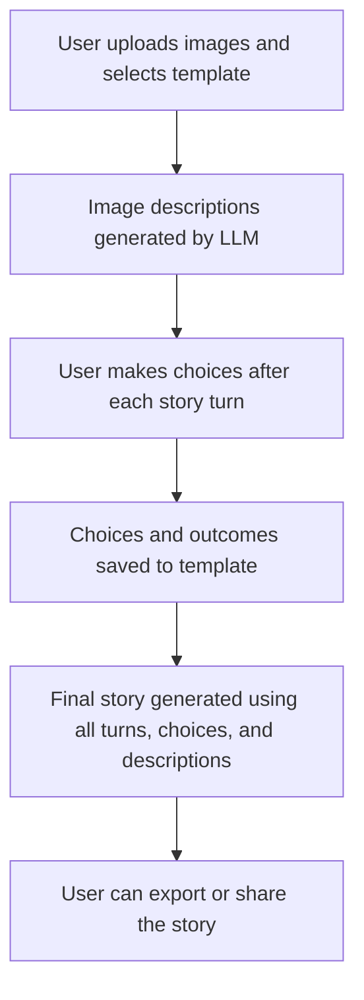
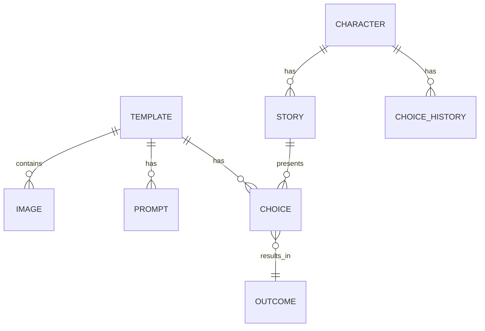
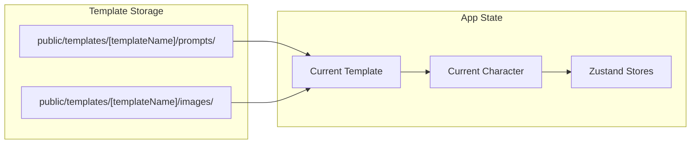
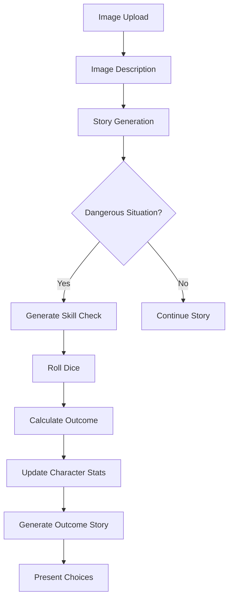
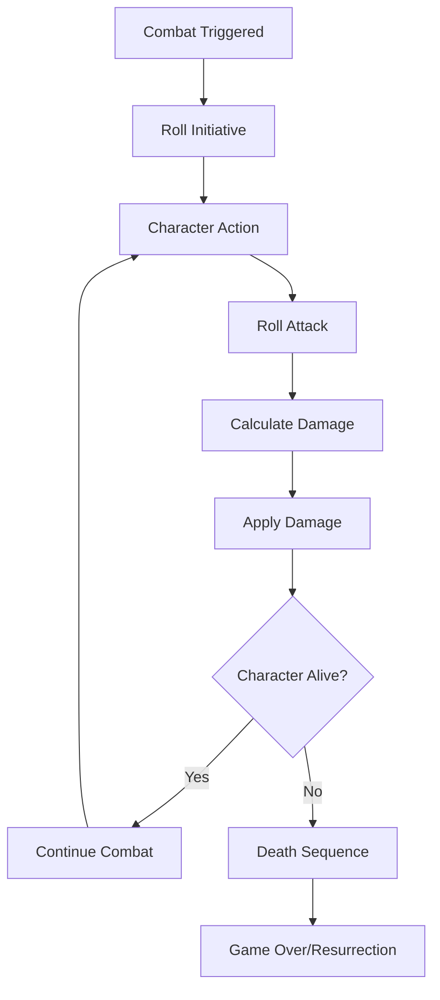

# Project Architecture Overview

## App Overview

**RPG AI Image Describer** is a Next.js application that transforms user-uploaded images into an interactive, turn-based storytelling game. Users select or import a template, upload images, and the app uses an LLM (via LM Studio) to generate detailed image descriptions and branching story segments. After each turn, the user is presented with choices (soon to be LLM-generated), and their decisions shape the narrative. All template data—including prompts and images—are stored in a portable, folder-based structure for easy sharing and extensibility. The system is designed for strict TDD, robust state management (Zustand), and future expansion into non-game use cases (e.g., marketing, education).

## Glossary

| Term                | Definition                                                                                           |
|---------------------|------------------------------------------------------------------------------------------------------|
| **Template**        | A JSON-based configuration that defines the structure, prompts, images, and rules for a game/story.  |
| **Turn**            | A single round in the game where an image is described and a story segment is generated.             |
| **Choice**          | A set of options presented to the user after each story turn, influencing the next story segment.    |
| **Outcome**         | The result of a user's choice, which may affect the story, character stats, or available options.    |
| **Prompt**          | A text instruction sent to the LLM to generate image descriptions, stories, or choices.              |
| **Story History**   | The accumulated story segments generated for each turn, used as context for the final story.         |
| **Final Story**     | A cohesive narrative generated at the end, weaving together all turns, choices, and outcomes.        |
| **Zustand Store**   | The global state management system used to track templates, character state, and game progress.      |
| **LM Studio**       | The local LLM server used for all AI generation tasks (image description, story, choices, etc.).     |
| **Toast**           | A non-intrusive notification shown to the user for key actions (save, import, error, etc.).          |
| **UUID**            | Universally Unique Identifier, used for all template and list keys to prevent React key collisions.  |
| **Portable Template** | A template folder containing all prompts (as JSON) and images, designed for easy sharing/import.   |

## System Diagrams

### 1. User Flow Diagram



### 2. Data Model (ER Diagram)



### 3. State & Storage Architecture



## Platform & Framework
- **Framework:** Next.js 15 (App Router)
- **Language:** TypeScript (strict mode)
- **Styling:** Tailwind CSS v4 (using `@import "tailwindcss"` syntax)
- **UI Components:** shadcn/ui
- **AI Integration:** LM Studio SDK

## Folder Structure
```
src/
├── app/                 # Next.js App Router (pages, layout, API routes)
├── components/          # React components (UI, layout, feature)
├── hooks/               # Custom React hooks
├── lib/                 # Utilities, constants, Zustand stores, types
│   ├── stores/          # Zustand state management
│   ├── types/           # TypeScript type definitions
│   └── ...
└── types/               # (Legacy or shared types)
public/                  # Static assets (images, icons)
jest.config.js           # Jest configuration
```

## State Management
- **Zustand** for all character/game state
  - Store: `src/lib/stores/characterStore.ts`
  - Uses `persist` middleware for localStorage persistence
  - All state updates are via store actions (no direct mutation)
  - **Image History:** Each image entry now stores its own AI-generated description and story, enabling robust per-turn display and replay.
- **Turn System:**
  - 3-turn limit, managed in Zustand
  - Reset Game button resets all state
  - All per-turn controls (upload, generate story, choices) are strictly gated to only appear at the correct stage for the current turn.

## Testing Process
- **Framework:** Jest + React Testing Library
- **Workflow:** Strict TDD (Test-Driven Development)
  - Write failing test → implement code → make test pass → refactor
  - All features require tests before implementation
- **Test Coverage:**
  - UI, state, and game logic are all covered
  - Reset Game and turn logic are explicitly tested
- **Run tests:** `npm test` or `npm run test:watch`
- **Build check:** `npm run build` (must pass before commit)

## TDD Process and Best Practices

### TDD Workflow for Each Feature
1. **Write Failing Tests First**
   - Create comprehensive test suite covering all requirements
   - Ensure tests fail initially (red phase)
   - Use descriptive test names that explain the expected behavior
   - Test edge cases and error conditions

2. **Implement Minimal Code**
   - Write only the code necessary to make tests pass (green phase)
   - Avoid over-engineering or implementing future features
   - Focus on the current failing test only

3. **Refactor and Improve**
   - Clean up code while ensuring tests continue to pass
   - Improve readability, performance, and maintainability
   - Maintain strict TypeScript typing throughout

4. **Quality Assurance**
   - Run all relevant tests to ensure no regressions
   - Verify production build succeeds (`npm run build`)
   - Test in browser for visual verification (`npm run dev`)

### Test Strategy Best Practices

#### Element Selection
- **Prefer `data-testid` attributes** for reliable element selection
- Use `within()` queries to scope assertions to specific components
- Implement `getAllByText()` with indexing for multiple instances
- Use function matchers for text that may be split across elements

#### Test Isolation
- Each test should be independent and not rely on previous test state
- Use fresh component instances for each test case
- Reset any global state between tests
- Avoid test interdependencies

#### State Management Testing
- Test component state changes and side effects
- Verify proper prop passing and event handling
- Test loading states, error states, and success states
- Ensure accessibility attributes are properly set

### Example TDD Implementation: Per-Turn Accordion Flow

#### Step 1: Write Comprehensive Failing Tests
```typescript
it('shows spinner while story is loading, then displays story as soon as available', () => {
  render(<TurnCard {...baseProps} isStoryLoading={true} story="" />);
  expect(screen.getByTestId('story-loader')).toBeInTheDocument();
  
  render(<TurnCard {...baseProps} isStoryLoading={false} story="The generated story!" />);
  const storyContent = screen.getAllByTestId('story-content').find(el => el.getAttribute('data-state') === 'open');
  expect(within(storyContent!).getByText('The generated story!')).toBeInTheDocument();
  expect(within(storyContent!).queryByText(/Not available yet/i)).not.toBeInTheDocument();
});
```

#### Step 2: Implement Component Logic
```typescript
<AccordionContent data-testid="story-content">
  {isStoryLoading ? (
    <div data-testid="story-loader" className="flex items-center gap-2 py-4">
      <LoadingSpinner /> <span>Generating story...</span>
    </div>
  ) : story ? (
    <div className="prose prose-sm max-w-none">{story}</div>
  ) : (
    <div className="text-gray-400 italic">Not available yet</div>
  )}
</AccordionContent>
```

#### Step 3: Test Refinement
- Handle multiple accordion instances with proper indexing
- Ensure correct accordion state before querying content
- Use robust selectors that work across different component states

### Key Technical Decisions

#### Component Architecture
- Add new props to interfaces with strict typing
- Maintain existing accessibility patterns
- Preserve UI/UX consistency with existing components
- Use conditional rendering for different states

#### Error Handling
- Implement graceful handling of component state changes
- Provide clear error messages for test failures
- Handle edge cases and unexpected states

### Lessons Learned
1. **Test Isolation**: Each test should be independent and not rely on previous test state
2. **Element Selection**: Use specific selectors (`data-testid`) rather than generic text queries when possible
3. **State Management**: Always verify the expected state before making assertions
4. **Accessibility**: Maintain proper ARIA attributes throughout implementation
5. **Type Safety**: Ensure all new props and interfaces are strictly typed

### Future TDD Implementations
This process can be applied to future features by:
1. Writing comprehensive failing tests that cover all requirements
2. Implementing minimal code to make tests pass
3. Refining tests and code iteratively
4. Ensuring full test coverage and build success
5. Documenting the process for future reference

## UI/UX
- **Layout:**
  - Responsive, stacked card layout (no grid)
  - Each image/turn is displayed as a vertical `GalleryCard` with:
    - The image at the top
    - An accordion below with two sections: "Image Description" (collapsed by default) and "Image Story" (expanded by default)
    - A "Turn X" label for each card, newest at the top
  - Header displays character stats
  - Main area: image upload, preview, description, story, and controls
- **Reset Game:**
  - Button appears if any turns have been used
  - Resets all state and clears persisted storage
- **Prompts:**
  - Dual prompt system (default/custom) for both image description and story generation
- **Per-Turn Flow:**
  - **Image Upload:** Only visible if no image has been uploaded for the current turn and no description is being generated or available.
  - **Image Description:** Spinner and content appear in the TurnCard for the current turn. As soon as a description is available, the upload area disappears.
  - **Generate Story:** Controls only appear after the image description is fully generated for the current turn, and disappear once the story is being generated or is available.
  - **Choices:** Controls only appear after the story is available for the current turn, and disappear once choices are being generated or are available.
  - This strict gating ensures a clear, stepwise RPG flow and prevents user confusion.

## Conventions & Best Practices
- **TypeScript:**
  - All code is strictly typed
  - No use of `any` except in legacy/test code
- **Component Structure:**
  - Components are colocated with their tests
  - Use functional components and hooks
- **State:**
  - All state is managed via Zustand store actions
  - No direct mutation of state outside the store
- **Testing:**
  - All new features require tests
  - Tests must pass before code is considered complete
- **Commits:**
  - Conventional commit messages (feat, fix, chore, etc.)
  - Commit after passing tests and build

## Decision Rationale
- **Next.js App Router:** Modern, flexible routing and layouts
- **Zustand:** Simple, scalable state management with persistence
- **shadcn/ui:** Modern, accessible UI components
- **TDD:** Ensures reliability and maintainability
- **Stacked Card Layout:** More flexible and visually appealing than a grid for this use case; supports per-turn replay and accordion-based detail viewing.

## Template System Architecture

### Overview
The template system provides complete game state persistence and restoration capabilities, enabling exact game resumption and rapid testing scenarios.

### Core Components

#### 1. Template Schema (`src/lib/types/template.ts`)
- **GameTemplate Interface**: Complete game state storage including character, images, prompts, configuration, and a `choices` array per turn (generated by the LLM, with all options and outcomes)
- **Validation Functions**: Strict type checking and data integrity validation
- **Template Utilities**: Creation, cloning, version compatibility checking
- **Application System**: Core logic for applying templates and restoring game state

#### 2. Template Store (`src/lib/stores/templateStore.ts`)
- **Zustand Store**: CRUD operations for template management
- **Template Selection**: Active template tracking and selection
- **Persistence**: Local storage integration for template persistence

#### 3. Template Manager UI (`src/components/TemplateManager.tsx`)
- **Template Management**: Create, select, delete, import/export templates
- **Template Application**: Apply templates with visual feedback
- **Missing Content Detection**: Display what content needs to be generated
- **Result Display**: Success/error states with detailed feedback

### Template Application Flow

#### 1. Template Validation
```typescript
const result = applyTemplate(template);
// Validates template structure, version compatibility, and data integrity
```

#### 2. Game State Restoration
```typescript
// Restore character state
characterStore.updateCharacter({
  ...template.character,
  currentTurn: calculatedTurn
});

// Restore image history
characterStore.updateCharacter({ imageHistory: [] });
template.images.forEach(image => characterStore.addImageToHistory(image));

// Restore final story if exists
if (template.finalStory) {
  characterStore.updateCharacter({ finalStory: template.finalStory });
}
```

#### 3. Missing Content Detection
- **Complete Templates**: No missing content (has final story)
- **Incomplete Templates**: Detect missing images and final story
- **Visual Feedback**: Display missing content list to user

### Integration Points

#### Character Store Integration
- **ExtendedCharacter Interface**: Added `finalStory` property for template integration
- **State Restoration**: Complete character state restoration from templates
- **Image History Management**: Bulk loading of template images

#### UI Integration
- **TemplateManager Component**: Full template management interface
- **Apply Button**: One-click template application
- **Result Display**: Visual feedback on application success/failure
- **Missing Content Warnings**: Clear indication of what needs generation

### Benefits

#### 1. Gameplay Continuity
- **Exact Resumption**: Resume games from exact saved state
- **Complete State**: Character stats, image history, turn progress preserved
- **No Data Loss**: All generated content maintained in templates

#### 2. Development Speed
- **Rapid Testing**: Use pre-generated templates for instant UI testing
- **Consistent Data**: Reliable test scenarios with known content
- **Template Reuse**: Share complete game sessions between developers

#### 3. User Experience
- **Visual Feedback**: Clear indication of template application status
- **Missing Content Awareness**: Users know what content needs generation
- **Error Handling**: Robust validation and error reporting

### Implementation Status

#### ✅ Phase 24.1: Enhanced Schema (COMPLETED)
- Complete GameTemplate schema with full game state
- Comprehensive validation and utility functions
- Template store with CRUD operations
- Basic template management UI

#### ✅ Phase 24.2: Template Application System (COMPLETED)
- `applyTemplate()` function with validation
- Character store integration for state restoration
- Missing content detection and reporting
- Enhanced TemplateManager UI with apply functionality
- Comprehensive test coverage

#### 🔄 Phase 24.3: Smart Content Regeneration (PENDING)
- Automatic detection of missing content
- AI-powered content generation for incomplete templates
- Integration with existing image analysis and story generation

#### 🔄 Phase 24.4: Testing Integration (PENDING)
- Template-based test data generation
- Integration with Jest testing environment
- Automated template application in test suites

#### 🔄 Phase 24.5: Advanced Features (PENDING)
- Template categories and search
- Template sharing and collaboration
- Advanced editing and management features

### Template Generation Type
- Each template includes a `type` field (e.g., `game`, `comics`, `business`, etc.).
- The app uses this field to enable or disable features and UI for different use cases.
- All new features must check the template type and be designed for extensibility.
- **For type 'game', each turn includes LLM-generated choices and outcomes, which are saved to the template and referenced in the final story.**
- **The final story prompt should reference both the choices and the outcomes for each turn.**
- **LLM-generated choices make the game more dynamic and replayable, and all choices/outcomes are persisted for export, sharing, and replay.**

---
This document should be updated as the project evolves. Use it as a reference for onboarding, architecture decisions, and best practices.

## Image Storage and Template Portability

### Best Practices
- All images referenced in templates should be stored in `public/imageRepository/` and referenced as `/imageRepository/filename.jpg`.
- On local development, copy uploaded/generated images to this folder.
- On template export, ensure all referenced images are present and optionally export as a zip with images + template JSON for portability.
- On Vercel (production), the `public/` folder is read-only; all images must be present at build time and committed to the repo.
- No uploads or LLM generation in production unless using a cloud storage backend.
- In the future, for uploads in production, use a cloud storage solution (e.g., S3, Supabase Storage) and update template image URLs accordingly.

### Environment Handling Table
| Environment      | Image Storage Location         | Uploads Allowed? | LLM Generation? | Template Usage         |
|------------------|-------------------------------|------------------|-----------------|-----------------------|
| Local (Windows)  | public/imageRepository/       | Yes              | Yes             | Generate & Export     |
| Vercel (Prod)    | public/imageRepository/       | No               | No              | Import & Use Only     |

### Notes
- This section is a reference for future-proofing and deployment strategy.
- When deploying to Vercel, ensure all images referenced in templates are present in `public/imageRepository/` and committed to the repo.
- For future cloud storage, update image management and template export/import logic accordingly.

## Turn Limit Editing (2025-07-01)
- The template system allows users to increase the turn limit at any time.
- Users can decrease the turn limit only if the current turn is less than or equal to the new limit.
- All turn-based logic (story generation, upload disabling, final story button, etc.) uses the dynamic turn limit from the template config.
- Validation prevents decreasing the turn limit below the current turn, with clear user feedback.

## Toast Notification System (2025-07-01)
- A global toast notification system is used for all key template and game interactions:
  - Export, import, save, delete, select, apply, and edit templates
  - Any other important user action (success or error)
- Toasts are small, subtle, and non-intrusive, appearing in a consistent location (e.g., bottom-right or top-right).
- Toasts disappear automatically after a short duration and are accessible to screen readers.
- All toast logic is centralized for maintainability and consistency.
- All relevant tests verify toast appearance and content for user actions.

## Template ID and Naming Architecture (2025-07-01)
- All template IDs are generated using `uuid.v4()` (from the uuid npm package) to guarantee uniqueness across all operations (creation, copy, import, edit).
- When a template is created, imported, or renamed to a duplicate, a new UUID is assigned.
- Template names are auto-incremented: if a name already exists, the new template will be named `name (copy)`, `name (copy 2)`, etc.
- This approach eliminates duplicate React key warnings and ensures a clear, user-friendly template list.
- The system is robust against all edge cases, including rapid user actions and bulk imports.

### Prompt and Image Storage (2025-07-xx)
- Prompts for each template are stored as JSON in `public/templates/[templateName]/prompts/prompts.json`, where `[templateName]` is a URL-safe string.
- All images for a template are stored in `public/templates/[templateName]/images/`.
- The template JSON references these relative paths for prompts and images.
- No zip export is required; copying the template folder is sufficient for portability and sharing.
- This approach is extensible for future cloud storage or advanced export/import features.

---

# AI Image Describer Architecture

## Future Directions & Use Cases

For a living list of game mechanics and creative/business/educational use cases, see [IDEAS.md](./IDEAS.md).

The codebase is designed to remain flexible and extensible, so that future features—such as branching game mechanics, marketing story generation, or educational tools—can be added without major refactoring.

---

# Documentation Review Workflow

## Overview
This workflow ensures comprehensive, up-to-date documentation when proposing or implementing new functionality. **Use the tiered approach in `DOCUMENTATION_REVIEW_TEMPLATE.md` for efficiency.**

## Quick Reference

### Tier 1: Small Changes (5-10 min)
- Bug fixes, minor UI tweaks, simple text changes
- Update code comments + quick test

### Tier 2: Medium Features (15-30 min)
- New components, API endpoints, state changes
- Update `ARCHITECTURE.md`, `spec.md`, add tests

### Tier 3: Major Features (30-60 min)
- New game mechanics, major refactoring, new template types
- Full documentation review + architecture impact assessment

## Required Documents for Review

### Core Documentation
1. **`ARCHITECTURE.md`** - System architecture, data models, technical decisions
2. **`spec.md`** - Project specification, phases, and implementation status
3. **`IDEAS.md`** - Future use cases and feature ideas (Tier 3)
4. **`README.md`** - Project overview and setup instructions (Tier 3)

### Supporting Documentation (Tier 3)
5. **`.cursor/rules/`** - Development workflow and coding standards
6. **Configuration files** - Dependencies, testing, TypeScript settings

## Essential Checklist (All Tiers)

### Before Implementation
- [ ] **What**: What exactly are we building?
- [ ] **Why**: Why are we building it this way?
- [ ] **How**: How does it fit into the existing architecture?
- [ ] **Future**: Will this work with all template types?

### During Implementation
- [ ] **Code Comments**: Document the "why" not just the "what"
- [ ] **Type Safety**: Ensure strict TypeScript types
- [ ] **Tests**: Write tests that document expected behavior

### After Implementation
- [ ] **Update Spec**: Mark tasks complete in `spec.md`
- [ ] **Update Architecture**: If data models or flow changed
- [ ] **Commit**: Clear commit message explaining the change

## Key Principles

### Efficiency Over Exhaustiveness
- **Focus on decisions**: Document the "why" not just the "what"
- **Update as you go**: Don't leave documentation for the end
- **Use the tier system**: Don't over-document simple changes
- **Leverage existing patterns**: Follow established conventions

### Quality Over Quantity
- **Consistency**: Use consistent terminology across all documents
- **Clarity**: Write for both current and future contributors
- **Currency**: Keep documentation updated with code changes
- **Completeness**: Every feature should be documented in at least one place

## Benefits

### For Current Development
- **Reduced Confusion**: Clear understanding of what needs to be updated
- **Better Planning**: Comprehensive impact assessment before implementation
- **Faster Iteration**: Tiered approach prevents over-documentation

### For Future Contributors
- **Quick Onboarding**: Complete picture of the project from multiple angles
- **Decision Context**: Understanding of why specific choices were made
- **Extensibility**: Clear guidance on how to add new features

## Implementation Notes

This workflow should be followed for:
- **All new feature proposals**
- **Major refactoring efforts**
- **Architecture changes**
- **Breaking changes or migrations**

**Use `DOCUMENTATION_REVIEW_TEMPLATE.md` for the detailed checklist and tier-specific guidance.**

## Dice Roll and Combat System Architecture

### Overview
The dice roll and combat system adds dynamic RPG mechanics to the storytelling experience. Character stats, health, and story outcomes are determined through dice rolls that create meaningful consequences and progression.

### Core Components

#### 1. Dice System (`src/lib/utils/dice.ts`)
- **Roll Functions**: `rollDice(sides: number)`, `rollWithModifier(base: number, modifier: number)`
- **Success Calculation**: `calculateSuccess(roll: number, difficulty: number)`
- **Critical System**: Critical success/failure detection and effects

#### 2. Combat System (`src/lib/utils/combat.ts`)
- **Damage Calculation**: `calculateDamage(attackRoll: number, defense: number)`
- **Health Management**: `applyDamage(character: Character, damage: number)`
- **Death Detection**: `checkDeath(character: Character)`
- **Status Effects**: Poison, healing, temporary buffs/debuffs

#### 3. Character Combat State
```typescript
interface CharacterCombatState {
  health: number;           // 0-200 (0 = dead)
  maxHealth: number;        // Base health capacity
  statusEffects: StatusEffect[];
  combatHistory: CombatEvent[];
  isAlive: boolean;
  lastDamageTaken: number;
}
```

#### 4. Dice Roll Types (`src/lib/types/dice.ts`)
```typescript
interface DiceRoll {
  id: string;
  type: 'combat' | 'skill' | 'saving_throw';
  dice: number;           // Number of dice (e.g., 1d20)
  sides: number;          // Sides per die (e.g., 20)
  modifier: number;       // Stat-based modifier
  result: number;         // Final roll result
  success: boolean;       // Whether roll succeeded
  critical: boolean;      // Critical success/failure
  timestamp: string;
  turnNumber: number;
}
```

### System Flow

#### 1. Story-Dice Integration


#### 2. Combat Flow


### Integration Points

#### Character Store Integration
- **Health Management**: Real-time health updates and death detection
- **Combat History**: Track all dice rolls and combat events
- **Status Effects**: Manage temporary buffs/debuffs
- **Experience**: Award XP for successful rolls and combat

#### Story Generation Integration
- **Danger Detection**: AI identifies dangerous situations in image descriptions
- **Skill Check Generation**: LLM suggests appropriate skill checks
- **Outcome Integration**: Story outcomes reflect dice roll results
- **Character State**: Stories reference current health and status

#### Choice System Integration
- **Risk Assessment**: Choices consider current health and combat state
- **Combat Choices**: Fight/flee/negotiate options with different risks
- **Stat-Based Success**: Character stats influence choice outcomes
- **Consequence Tracking**: All outcomes affect future story generation

### UI Components

#### 1. Dice Roll Display (`src/components/DiceRoll.tsx`)
- **Visual Dice**: Animated dice roll with sound effects
- **Result Display**: Clear success/failure indication
- **Modifier Breakdown**: Show how stats affected the roll
- **History**: Recent dice rolls and outcomes

#### 2. Health Display (`src/components/HealthBar.tsx`)
- **Health Bar**: Visual health indicator with color coding
- **Status Effects**: Display active buffs/debuffs
- **Combat State**: Show if in combat or safe
- **Death Indicator**: Clear game over state

#### 3. Combat Notifications (`src/components/CombatNotification.tsx`)
- **Damage Popup**: Show damage taken/dealt
- **Critical Hits**: Special effects for critical rolls
- **Status Updates**: Notify of new status effects
- **Death Notification**: Handle character death gracefully

### Template Integration

#### Game Template Type
- **Combat Settings**: Enable/disable combat for different template types
- **Difficulty Scaling**: Adjust dice roll difficulties based on template
- **Starting Health**: Set initial character health
- **Combat Rules**: Customize combat mechanics per template

#### Template Persistence
- **Combat History**: Save all dice rolls and combat events
- **Character State**: Persist health, status effects, and combat state
- **Story Integration**: Include combat outcomes in final story generation
- **Replay Support**: Allow replaying combat scenarios

### Benefits

#### 1. Dynamic Gameplay
- **Unpredictable Outcomes**: Dice rolls create genuine uncertainty
- **Meaningful Consequences**: Health and stats affect story progression
- **Risk Management**: Players must consider their character's state
- **Replayability**: Different outcomes each playthrough

#### 2. Character Development
- **Stat Progression**: Successful rolls improve character abilities
- **Experience System**: Combat and skill checks award XP
- **Status Effects**: Temporary buffs/debuffs add depth
- **Death/Resurrection**: High stakes with recovery mechanics

#### 3. Story Integration
- **Consequential Choices**: Story outcomes reflect character state
- **Combat Narratives**: Rich combat descriptions and outcomes
- **Character Growth**: Stories reflect character progression
- **Tension Building**: Health and status create narrative tension

### Implementation Status

#### 🔄 Phase 1: Core Dice System (PLANNED)
- Dice roll utilities and types
- Basic success/failure calculation
- Critical success/failure detection
- Comprehensive test coverage

#### 🔄 Phase 2: Health & Combat System (PLANNED)
- Health management and damage calculation
- Death detection and resurrection mechanics
- Status effect system
- Combat event tracking

#### 🔄 Phase 3: Story-Dice Integration (PLANNED)
- Danger detection in story generation
- Skill check generation and resolution
- Story outcome integration
- Character state reflection in narratives

#### 🔄 Phase 4: UI Components (PLANNED)
- Dice roll animations and display
- Health bar and status indicators
- Combat notifications
- Death/resurrection UI

#### 🔄 Phase 5: Advanced Features (PLANNED)
- Experience and leveling system
- Inventory items affecting combat
- Advanced status effects
- Multi-character combat

---

## Future Directions & Use Cases 